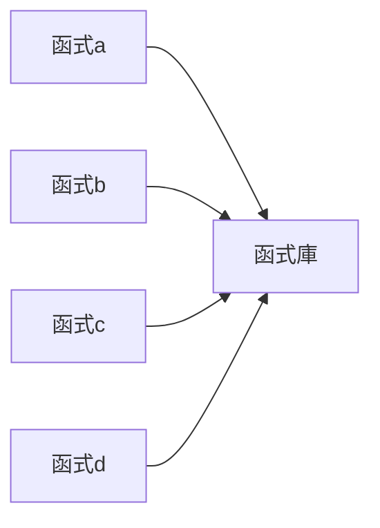
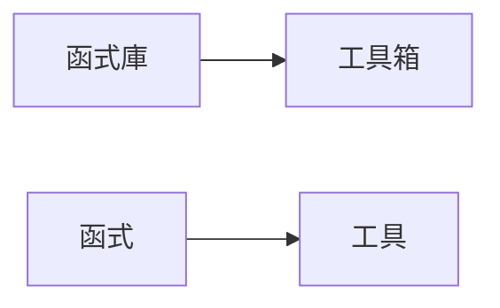
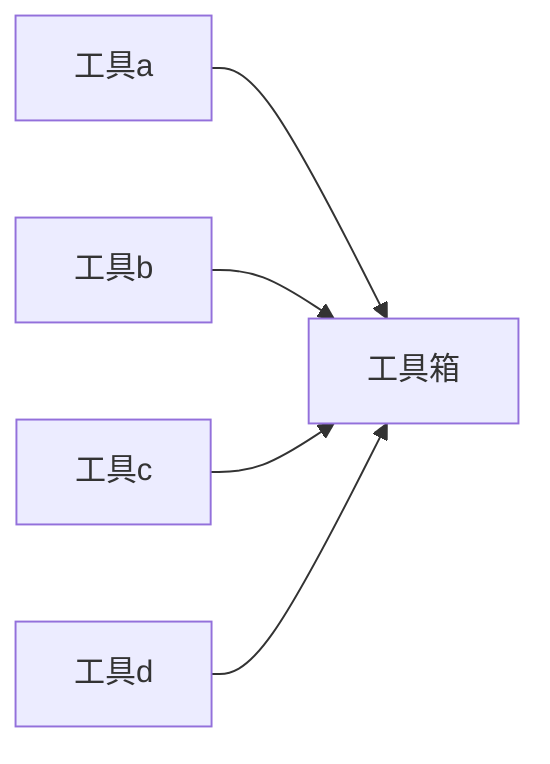
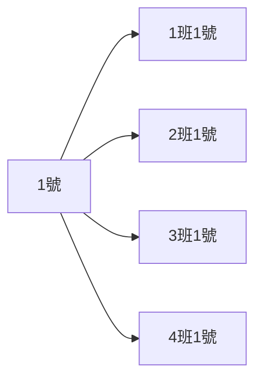
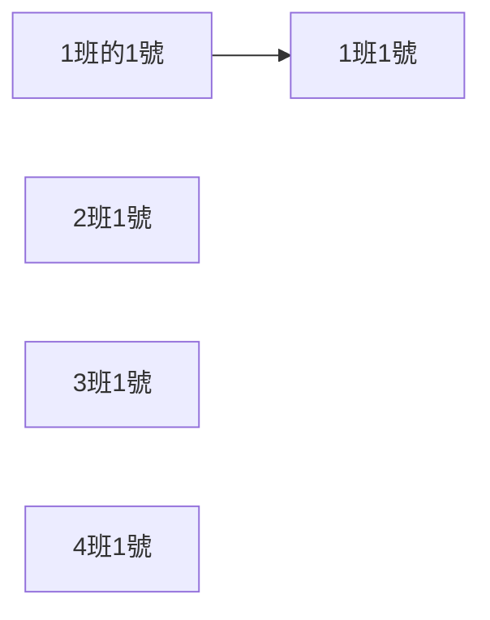

# **C++ 筆記**  
## 概論 Introduce  

# 基本架構  

```cpp
#include<iostream>
using namespace std;

int main(){
    
    
    return 0;
}
```

## 導入函式庫  

```cpp
#include<iostream>
```

第一行的這個由 ```#include``` 和 ```<iostream>``` 組成的東西  
意思是 導入一個叫```<iostream>```的函式庫  

函式庫就是一個放了很多函式的地方  


```圖一```


而函式庫可以理解成工具箱  
函式則理解成工具  


```圖二```

所以上面的圖一就可以修改為比較親民的  

```圖三```

當然，我們不可能只有一個函示庫，根據裡面函示的不同，我們還有  


|   容器    |    一般   |  輸入輸出  |
| -------- | --------  | -------- |
|bitset  |algorithm |fstream |
|deque   |functional |ios    |
|list    |iterator |iostream |
|map     |locale |iosfwd     |
|queue   |memory |istream    |
|set     |stdexcept |ostream |
|stack   |utility |sstream   |
|vector  |time.h |iomanip    |

等等的函示庫（當然其實還有，這邊只是列一個皮毛而已）  

然後因為這邊東西太多了，所以有大神把它整理成了一個萬用函示庫  

```<bits/stdc++.h>```

這裡面包含了所有以上列的，還有沒有列的函示庫  
所以第一行基本上會修正成  
```cpp 
#include<bits/stdc++.h>
```

---

## 命名空間

```cpp
using namespace std;
```

第二行的 ```using namespace std;``` 是指未來的程式碼，若沒有特別指定，將都會在 std 的空間下運行  
    
當然，這一行可寫可不寫，但如果沒寫以後的程式碼中，如果用到函式，都須在前面加上 ```std ::``` 才可以用行  

而命名空間的存在是因為，剛剛列了那麼多的函式庫，總會有幾個的名稱會衝突到，就好像每個班級都有 1 號，若只呼叫一號，便會出現下面的情況  
    

```圖四```

命名空間就好像指定班級一樣，這樣就不會叫到錯誤的函數了  
    

```圖五```
    
---

## 主函式  

```cpp
int main(){


    return 0;
}
```
    
大部分的 code 都會在主函式中撰寫  
    
第 4 行 主要由 ```int``` 和 ```main()```   
前者為資料型態，後者就是主函式的英文  
而最尾巴的和 第 8 行 的 ```{ }``` 是代表主函式的範圍  
    
第 7 行 ```return 0;``` 是回傳值，在這裡可寫可不寫，剩下的在函式的部分會再細說  
