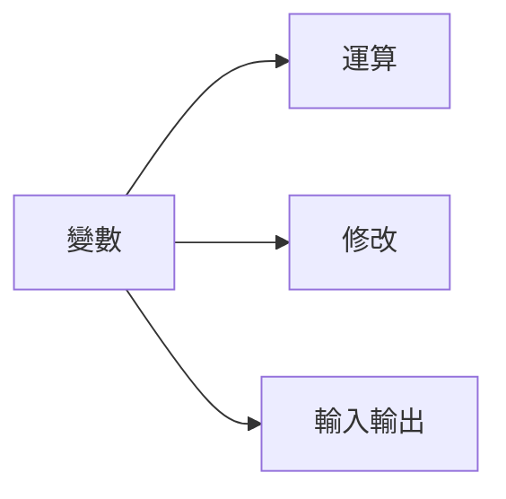
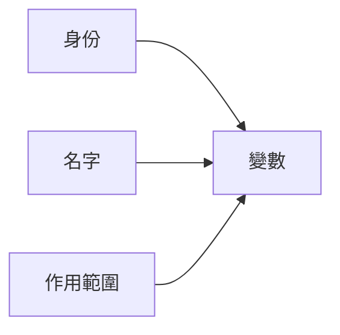
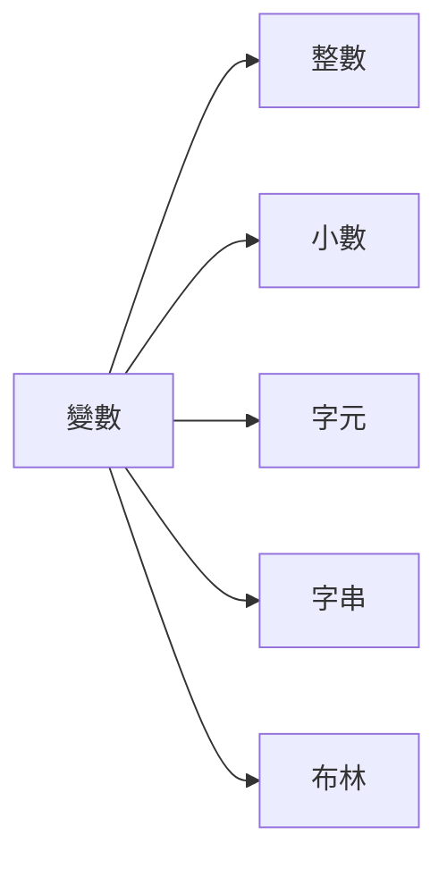

# **程式 筆記**  
## 變數與資料型態 Variables and Types  

# 基本介紹  

## 變數  

C++ 可以理解成一台計算機，所以要有「東西」去紀錄數值和結果  

因此， **變數** 就出現了  

```圖一```

接下來，如圖二所示，身為一個變數，他必須知道  

1. `身份`：他要做什麼  
2. `名字`：他是誰 
3. `作用範圍`：他在哪裡  

~~我是誰我在哪裡我要做什麼~~  


```圖二```

---

### 變數 - 身份

身為一個變數，他必須知道他要做什麼  

所以我們要給他一個身份，例如：整數、小數、字元、字串、布林 等等  

這些身份我們稱作：**資料型態**  


```圖三```

> ### 整數

|           名稱           |                                         範圍                                         |
|:------------------------:|:------------------------------------------------------------------------------------:|
|       ` long ` int       |             -2,147,483,648 ( $-2^{31}$ ) ~ 2,147,483,647 ( $2^{31}$-1 )              |
|    long long ` int `     | -9,223,372,036,854,775,808 ( $-2^{63}$ ) ～ 9,223,372,036,854,775,807 ( $2^{63}-1$ ) |
| unsigned long long `int` |                    0 ～ 18,446,744,073,709,551,615 ( $2^{64}-1$ )                    |

> ### 小數 ( 浮點數 )

|  名稱  |               範圍               |
|:------:|:--------------------------------:|
| bouble | 有效位數 15 (可以存到小數點14位) |
| float  |   有效位數 7 (存到小數點下6位)   |

`因為本身存在誤差，所以相減如果差小於 1e-7 ( 10-7 ) ，就當成 0`

> ### 字元 char

字元就是我們平常看到的字，例如：  

'V' 'i' 'n' 'c' 'e' 'n' 't' 't' 'a' 'i' 'n' 'a' 'n'  

然後每個字，都有對應的編號，見 ASCII 碼，例如：  

’A’ = 65 , ‘Z’ = 90 , ‘a’ = 97 , ‘z’ = 122 , ‘0’ = 48 , ‘9’ = 57  


``` ASCII碼 ```[圖源](https://ithelp.ithome.com.tw/articles/10283394?sc=pt)  

> ### 字串 string

一句話、半句話、兩個字，都可以是字串，例如：  

"Vincenttainan" "ha"  

> ### 布林 bool

只有 0（false）或 1（true）兩種值

---

### 變數 - 名字

身為一個變數，他必須知道他的名字  

取名可以依自己的喜好，但建議使用大小寫英文字母  

注意不要用到電腦內建的東西（關鍵字），例如：  

max , min , main , int 等等  

---

### 變數 - 作用範圍

身為一個變數，他必須知道他活在哪裡  

也就是所謂的 **值域**  

這個變數的作用範圍  

大部分都以`{}`為界線，出去的就不認這個變數了  

---

### 變數宣告
```cpp
#include<bits/stdc++.h>
using namespace std;

int main(){
    
    int a;
    
}
```
這樣，你就宣告了一個變數了  

### 變數運算

同時，也可以在宣告這個變數時，賦予他數值  

```cpp
int a=5;
```

當然也可以對他加減乘除  

```cpp
int a=5;
int b;
b=a*5
//b=25
```

## 快樂的練習時間

[TOJ 5](https://toj.tfcis.org/oj/pro/5/)
[TOJ 92](https://toj.tfcis.org/oj/pro/92/)
[TOJ 93](https://toj.tfcis.org/oj/pro/93/)
[TOJ 98](https://toj.tfcis.org/oj/pro/98/)
[TOJ 100](https://toj.tfcis.org/oj/pro/100/)
[TOJ 101](https://toj.tfcis.org/oj/pro/101/)
[TOJ 128](https://toj.tfcis.org/oj/pro/128/)
[TOJ 339](https://toj.tfcis.org/oj/pro/339/)
