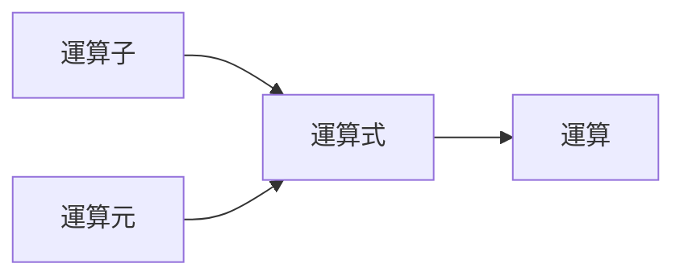
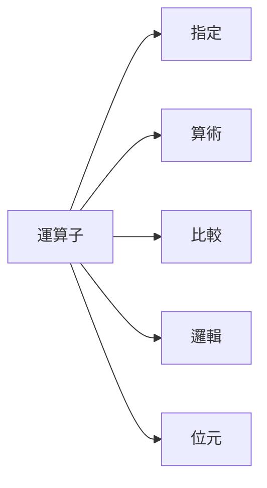

# **C++ 筆記**
## 四則運算與運算式 ArithmeticOperations  

# 數學中的式子  

## 運算式與運算子  

$1 + 1 = 3 - 1$  


這是等式，在數學中  
他是表示 $1 + 1$ 的結果等於 $3 - 1$ 的結果  


然後我們先看一邊 $1 + 1$ ，這就是運算式  
當然還有很多，例如：  
$8 + 9$  ,  $6 * 5$  ,  $7 / 3$ 等等  

```cpp
int a=5;
int b;
b = a * 5;
//b=25
```

之前變數修改有提到  
四則運算可以直接作用在變數上  


但準確來說  
運算是由運算式組成的  
運算式是由運算子跟運算元組成  

剛剛說的  

$1 + 1$  

其中的兩個 1 就是運算元  
而的 $+$ 就是運算子的一種  



其中運算子又分成指定、算術、比較、邏輯  

### 指定運算子  

先看看我們之前寫的  

```cpp
b = a * 5;
```

裡面的「＝」就是指定運算子  

但跟數學中的「相等」意思不同  

這裡比較像是「指派」的意思  

就是把（a * 5）的值計算出來後，指派給 b 去儲存  

所以就會出現接下來這種東西  

```cpp
int a = 5;
//a=5
a = a + 1;
//a=6
a = a * 3;
//a=18
```

### 算術運算子  

接下來應該是比較熟悉的部分  


| 符號 |                             意義                             |    舉例    |
|:----:|:------------------------------------------------------------:|:----------:|
|  +   |                              加                              | 6 + 4 = 10 |
|  -   |                              減                              | 6 - 4 = 2  |
|  *   |                              乘                              | 6 * 4 = 24 |
|  /   |                              除                              | 6 / 4 = 1  |
|      | 註：若除運算子前後皆為整數，則運算後結果亦為整數且無條件捨去 |            |
|  %   |                             取餘                             | 6 % 4 = 2  |
|      |           註：取餘運算子只適用於前後皆為整數的情況           |            |

且跟數學一樣可以用（）表示優先順序  

所以就可以列出  
```cpp
ans1=-b+sqrt((b*b-4*a*c))/2*a
ans2=-b-sqrt((b*b-4*a*c))/2*a
```  
用來運算二元一次方程式的根  

$ans=\cfrac{-b\pm\sqrt{b^2-4ac}}{2a}$  

之類的東西  

### 奇怪的算法  

算術運算子加上剛剛的指定運算子  
可以寫出下面的程式：  

`a + = b` 相等於 `a = a + b`  
然後如果 b 等於 1 時  
還可以寫成 `a++`  

同理  
`a -= b`、`a*=b`、`a/=b`  
都是合法的  

### 比較運算子  

這跟之後的條件式有關  
而且相對直覺  

| 符號 |   意義   |   舉例   |    結果    |
|:----:|:--------:|:--------:|:----------:|
|  >   |   大於   |  2 > 1   | 1（True）  |
|  >=  | 大於等於 |  3 >= 4  | 0（False） |
|  <   |   小於   |  5 < 6   | 1（True）  |
|  <=  | 小於等於 |  8 <= 7  | 0（False） |
|  ==  |   等於   | 9 == 10  | 0（False） |
|  !=  |  不等於  | 11 != 12 | 1（True）  |

### 邏輯運算子  

| 符號 | 中文 | 意義 |
| -------- | -------- | -------- |
| &&     | 且     | 比較左右兩個條件，皆為 1 才輸出 1 ，否則輸出 0      |
| &#124;&#124; |或|比較左右兩個條件，有一者為 1 便輸出 1 ，否則輸出 0 |
|!|否|取之後的條件，若本來為 1 便輸出 0 ，反之，若為 0 便輸出 1|

* &&  

||true|false|
|---|---|---|
|**true**|true|false|
|**false**|false|false|

* ||  

|           | true | false |
|:---------:|:----:|:-----:|
| **true**  | true | true  |
| **false** | true | false |

* !  


|   true    | --> |  false   |
|:---------:|:---:|:--------:|
| **false** | **-->** | **true** |

### 位元運算子  

|  符號  |      中文      |                                    意義                                     |
|:------:|:--------------:|:---------------------------------------------------------------------------:|
|   &    |   與 ( and )   |     比較前後兩運算元的每位，若兩者皆為 1 則結果位元會設為 1，否則皆為 0     |
| &#124; |   或 ( or )    | 比較前後兩運算元的每位，若兩者至少其中之一為 1 則結果位元會設為 1，否則為 0 |
|   ~    |   反 ( not )   |         後方運算元的每位，若原本為 1 則結果位元會設為 0，反之設為 1         |
|   ^    | 互斥或 ( xor ) |     比較前後兩運算元的每位，若兩者僅一為 1 則結果位元會設為 1，否則為 0     |
|   <<   |      左移      |                         將後方運算元向左平移一單位                          |
|   >>   |      右移      |                         將後方運算元向右平移一單位                          |

* and ( & )

|  | 1 | 0 |
| --- | --- | --- |
| **1** | 1 | 0 |
| **0** | 0 | 0 |

* or ( | )

|  | 1 | 0 |
| --- | --- | --- |
| **1** | 1 | 1 |
| **0** | 1 | 0 |

* not( ~ )

|   1    | --> |  0   |
|:---------:|:---:|:--------:|
| **0** | **-->** | **1** |

* xor ( ^ )

|  | 1 | 0 |
| --- | --- | --- |
| **1** | 0 | 1 |
| **0** | 1 | 0 |

## 快樂的練習時間  

[TOJ 124](https://toj.tfcis.org/oj/pro/124/)  
[TOJ 236](https://toj.tfcis.org/oj/pro/236/)  
[TOJ 237](https://toj.tfcis.org/oj/pro/237/)  
[TOJ 330](https://toj.tfcis.org/oj/pro/330/)  
[TOJ 341](https://toj.tfcis.org/oj/pro/341/)  
