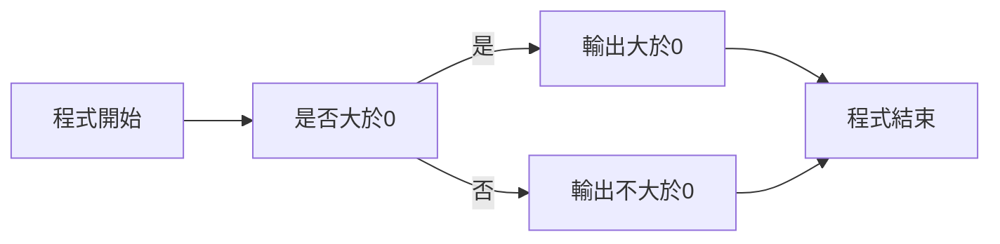
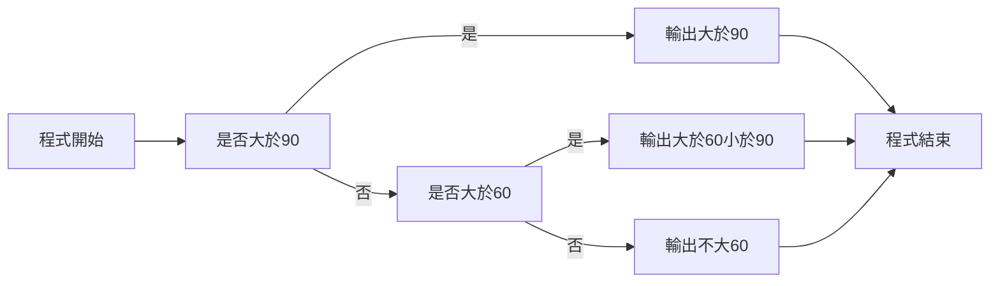

# **程式 筆記**  
## 條件 Condition  

# 基本架構 if  
```cpp
if(condition_1){
    //do when condition_1 is true
}
```

條件：所有的條件，最後都要能變成 true / false 其中之一  

舉個例子：  
```cpp
if(口渴了){
    喝水
}
```

例如我們想知道一個輸入有沒有大於 10  

```cpp
#include<bits/stdc++.h>
using namespace std;

int main(){
    
    int a;
    cin>>a;
    if(a>10){
        cout << "大於10" <<endl;
    }
    
}
```


`流程圖`

根據上述的內容，如果你想寫出符合兩個條件的程式碼  

可能會寫出…  

```cpp
if(a>10){
    if(a<20){
        cout << "大於10，小於20" <<endl;
    }
}
```


`流程圖`

但如果結合了前面說的邏輯運算子  

就可以改成  

```cpp
if(a>10 && a<20){
        cout << "大於10，小於20" <<endl;
    }
}
```


`流程圖`

# 基本架構 if else  

```cpp
if(condition_1){
    //do when condition_1 is true
}

else{
    //do when condition_1 is not ture
}
```

注意 : 他必須是只有兩種情況的事件  

例如：一個數字  
他不是大於0  
就是不大於0 (廢話@@)  

```cpp
if(a>0){
    cout << "大於10" << endl;
}
else{
    cout << "不大於10" << endl;
}
```


`流程圖`

那，如果有三種以上的情況呢？  

比如說：  

考試，  
90分以上  
60分到90分  
60分以下  

你可能會寫出  

```cpp
if(a>90){
    cout << "大於90" << endl;
}
else{
    if(a>60){
        cout << "大於60，小於90" << endl;
    }
    else{
        cout << "不大於60" << endl;
    }
}
```

但其實可以  

```cpp
if(a>90){
    cout << "大於90" << endl;
}
else if(a>60){
    cout << "大於60，小於90" << endl;
}
else{
    cout << "不大60" << endl;
}
```


`流程圖`

# 基本架構 if else if else  
```cpp
if(condition_1){
    //do when condition_1 is true
}
else if(condition_2){
    //do when condition_1 is not true and condition_2 is true
}
.
.
.
else if(cindition_n){
    //do when condition_1 to condition_n-1 is not true but condition_n is true
}
else{
    //do when all the condiiton above is not true
}
```
