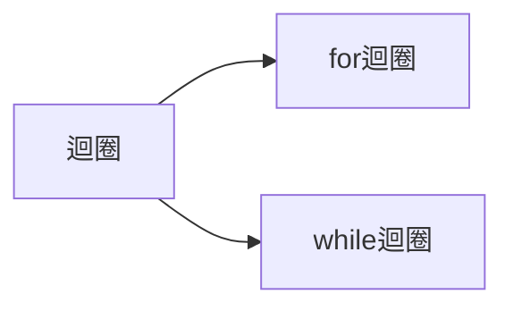
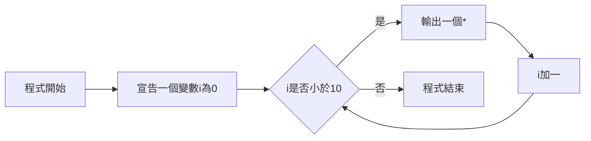
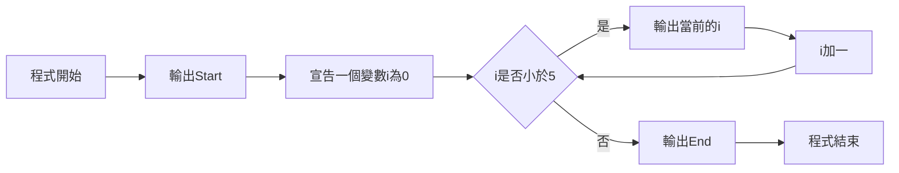
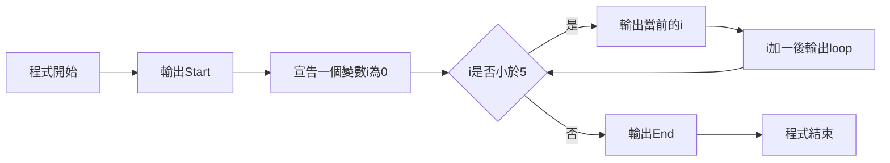
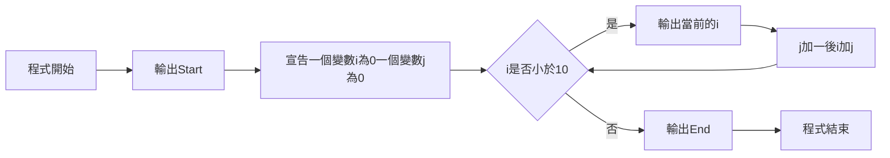
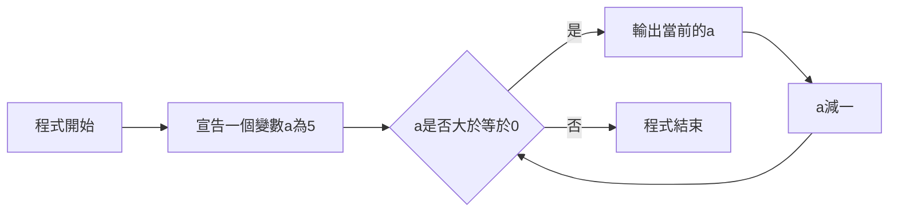
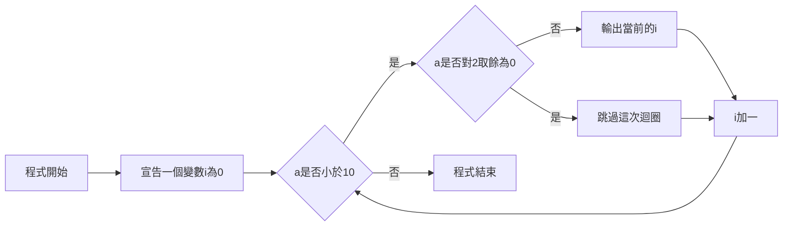
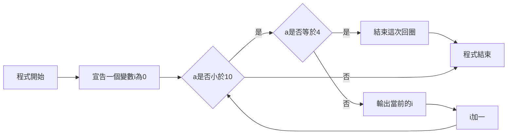

# **程式 筆記**  
## 迴圈 loop  

當你有一件重複的事情要做時  
例如要輸出一行`*`做分隔線  

當然可以  
```cpp
cout << "*********************************" <<endl;
```

但如果要輸出10行呢？50行呢？  
這時候你就需要  迴圈  

在 C++ 裡面，迴圈主要有兩種  
分別是  

* for迴圈  
* while迴圈  



# 基本架構 for  
```cpp
for(setup, condition, do when the loop runs once){
    //what you want to do
}
```

* setup：  
設定，只會跑一次，剛進入迴圈時執行  
如果是設一個變數，變數只能在迴圈中使用  

* condition：  
放一個條件判斷，如果成立就會執行迴圈內的程式，否則就離開迴圈  

* do when the loop runs once：  
當跑完回圈內的程式，會執行那裏的程式  

* what you want to do:  
每圈會做的事情  

例如：  

```cpp
for(int i=0, i<10, i++){
    cout<<"*";
}
cout<<endl;
```
`程式碼`
```
**********
```
`輸出結果`

`流程圖`

---

更多範例：  
```cpp
cout << "Start" << endl;
for(int i=0; i<5; i++){
    cout << i << endl;
}
cout << "End" << endl;
```
`程式碼`
```
Start
0
1
2
3
4
End
```
`輸出結果`

`流程圖`

---

```cpp
cout << "Start" << endl;
for(int i=0; i<5; i++, cout << "loop" << endl){
    cout << i << " ";
}
cout << "End" << endl;
```
`程式碼`
```
Start
0 loop
1 loop
2 loop
3 loop
4 loop
End
```
`輸出結果`

`流程圖`

---

```cpp
cout << "Start" << endl;
for(int i=0, j=0; i<10; j++, i+=j){
    cout << i << " ";
}
cout << "End" << endl;
```
`程式碼`
```
Start
0
1
3
6
End
```
`輸出結果`

`流程圖`


|       | 變數i | 變數j |
|:-----:|:-----:|:-----:|
| 第1圈 |   0   |   0   |
| 第2圈 |   1   |   1   |
| 第3圈 |   3   |   2   |
| 第4圈 |   6   |   3   |
| 第5圈 |  10   |   4   |

---

# 基本架構 while  
```cpp
while(condition){
    //what you want to do
}
```
* condition  
放一個條件判斷，如果成立就會執行迴圈內的程式，否則就離開迴圈  

* what you want to do  
每圈會做的事情  

例如：
```cpp
int a=5;
while(a>=0){
    cout << a << endl;
    a--;
}
```
`程式碼`
```
5
4
3
2
1
0
```
`輸出結果`

`流程圖`

while迴圈通常用在  

* 多筆輸入  
* 不確定結束時間的  
* 不需要計次的  

```cpp
int t=0;
cin>>t;
while(t--){
    //things you want to do
}
```
`告訴你有t筆測資時`
```cpp
int t;
while(cin>>t){
    //things you want to do
}
```
`沒有告訴你有幾比測資時` 或 `會輸入直到EOF`

---

# 迴圈內可用語法  

* break
直接離開迴圈，終止迴圈

* continue
跳過這次的迴圈，直接執行下一圈

```cpp
for(int i=0; i<10; i++){
    if(i%2==0){
        continue;
    }
    cout << i << endl;
}
```
`程式碼`
```
1
3
5
7
9
```
`輸出結果`

`流程圖`

---

```cpp
for(int i=0; i<10; i++){
    if(i==4){
        break;
    }
    cout << i << endl;
}
```
`程式碼`
```
0
1
2
3
```
`輸出結果`

`流程圖`

## 快樂的練習時間

[TOJ 105](https://toj.tfcis.org/oj/pro/105/)  
[TOJ 106](https://toj.tfcis.org/oj/pro/106/)  
[TOJ 109](https://toj.tfcis.org/oj/pro/109/)  
[TOJ 224](https://toj.tfcis.org/oj/pro/224/)  
[TOJ 586](https://toj.tfcis.org/oj/pro/586/)  
[TOJ 587](https://toj.tfcis.org/oj/pro/587/)  
[TOJ 588](https://toj.tfcis.org/oj/pro/588/)  
[TOJ 589](https://toj.tfcis.org/oj/pro/589/)  
[TOJ 590](https://toj.tfcis.org/oj/pro/590/)  
[TOJ 591](https://toj.tfcis.org/oj/pro/591/)  
[TOJ 592](https://toj.tfcis.org/oj/pro/592/)  
[TOJ 593](https://toj.tfcis.org/oj/pro/593/)  
[TOJ 594](https://toj.tfcis.org/oj/pro/594/)  
[TOJ 595](https://toj.tfcis.org/oj/pro/595/)  
[TOJ 596](https://toj.tfcis.org/oj/pro/596/)  
[TOJ 597](https://toj.tfcis.org/oj/pro/597/)  
[TOJ 598](https://toj.tfcis.org/oj/pro/598/)  
