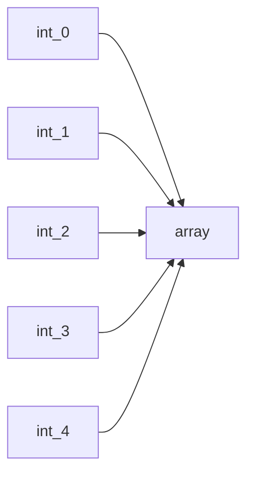

# **程式 筆記**  
## 陣列 Array  

如果你要算 30 個數的平均  

```cpp
int a,b,c,d,e,f………;
```

也不是不行啦，但做起來十分沒有效率  

所以就有陣列來處理這事情  

# 基本架構 array  

如同宣告變數一般只是在後面加中括號，中括號內寫要幾個這種變數  

```cpp
int arr[100];
bool b[100];
string str[100];
char c[100];
```



# 使用方式：  

arr[10] 拿到編號第十的值  
arr[i] 拿到編號為i的值  

可以做的事完全跟變數一樣  
例如：  

```cpp
arr[100]=1024;
arr[101]++;
arr[102]=arr[103]+arr[104];
```

## 注意：  
* 拿取超過宣告的陣列範圍 會出現 RE 喔  
* 陣列編號是從 0 開始  

所以你開 n 個大小的陣列  
編號會是 0 ~ n-1  
因此開1000個 只能拿到 arr[999]  

* 建議多開的 5~15個值  

## 常用輸入方法：

1. 因為陣列會開到很大  
不可能一個一個輸入  
所以通常都用for輸入  
可以用for內部的變數當作編號輸入  

```cpp
for(int i=0; i<n; i++){
    cin>>arr[i];
}
```

2. 陣列有時候會宣告到 10000000 以上  
這時如果放在int main(){ } 裡會出錯  
```cpp
#include<bits/stdc++.h>
using namespace std;

int main(){
    int arr[10000005]={0};
    cout << "test" << endl;
}
```
```
```
`輸出結果(對，什麼都沒有)`
&#8195;&#8195;這時就要放到int main()的外面  
```cpp
#include<bits/stdc++.h>
using namespace std;

int arr[10000005]={0};

int main(){
    cout << "test" << endl;
}
```
```
test
```
`輸出結果`
&#8195;&#8195;目前測試到 500000000 都還可以  

## 常用技巧：  

### 前綴和  

因為一直計算第 `i` 到 `j` 項的和很浪費時間  
所以我們多開一個陣列，第 `i` 項時，紀錄第 `0` 到 `i` 的合  
要求第 `i` 到 `j` 項的和時，就用 `arr[j]` - `arr[i-1]`  
```cpp
for(int i=1; i<10; i++){
    arr[i]=arr[i-1]+a[i];
    //arr為新陣列
    //a為原本陣列
}
```

## 補充：  

string嚴格來說，是char的陣列  

```cpp
string s="Vincenttainan";

cout << s[0] << " " << s[4] << endl;
```
```
V e
```
`輸出結果`

```cpp
string s="Vincent tainan";
s[7]='_';
cout << s << endl;
```
```
Vincent_tainan
```
`輸出結果`

## 快樂的練習時間

[TOJ 3](https://toj.tfcis.org/oj/pro/3/)  
[TOJ 112](https://toj.tfcis.org/oj/pro/112/)  
[TOJ 113](https://toj.tfcis.org/oj/pro/113/)  
[TOJ 115](https://toj.tfcis.org/oj/pro/115/)  
[TOJ 117](https://toj.tfcis.org/oj/pro/117/)  
[TOJ 118](https://toj.tfcis.org/oj/pro/118/)  
[TOJ 119](https://toj.tfcis.org/oj/pro/119/)  
[TOJ 120](https://toj.tfcis.org/oj/pro/120/)  
[TOJ 123](https://toj.tfcis.org/oj/pro/123/)  
[TOJ 127](https://toj.tfcis.org/oj/pro/127/)  
[TOJ 274](https://toj.tfcis.org/oj/pro/274/)  
[TOJ 292](https://toj.tfcis.org/oj/pro/292/)  
[TOJ 355](https://toj.tfcis.org/oj/pro/355/)  
[TOJ 517](https://toj.tfcis.org/oj/pro/517/)  
[TOJ 518](https://toj.tfcis.org/oj/pro/518/)  
