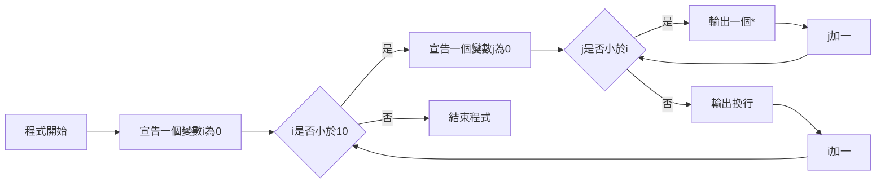

# **程式筆記**
## 巢狀迴圈 nested loop

其實就是在迴圈裡面再塞迴圈  

例如之前說的輸出一行`*`當分隔線  

如果改成輸出一個$10*10$的正方形`*`  

雖然說單層的for迴圈就可以做到  

```cpp
for(int i=0; i<10; i++){
    cout << "**********" << endl;
}
```

但其實可以改成兩層的迴圈  

```cpp
for(int i=0; i<10; i++){
    for(int j=0; j<10; j++){
        cout << "*";
    }
    cout << endl
}
```
`程式碼`
```
**********
**********
**********
**********
**********
**********
**********
**********
**********
**********
```
`輸出結果`

`流程圖`

巢狀迴圈的運作順序  
可以想成類似時鐘的運作  
分針就像內層迴圈，會先跑完  
外層迴圈，也就是時針才會走  

## 更多範例：
```cpp
for(int i=0; i<10; i++){
    for(int j=0; j<i; j++){
        cout << "*";
    }
    cout << endl;
}
```
`程式碼`
```

*
**
***
****
*****
******
*******
********
*********
```
`輸出結果`

`流程圖`

|       | 變數i | 變數j | 輸出\*數量 |
|:-----:|:-----:|:-----:|:-----:|
| 第1圈 |   0   |   0~0   |0|
| 第2圈 |   1   |   0~1   |1|
| 第3圈 |   2   |   0~2   |2|
| 第4圈 |   3   |   0~3   |3|
|...|...|...|...|
| 第10圈 |   9   |   0~9   |9|

## 快樂的練習時間  

[TOJ 17](https://toj.tfcis.org/oj/pro/17/)  
[TOJ 110](https://toj.tfcis.org/oj/pro/110/)  
[TOJ 121](https://toj.tfcis.org/oj/pro/121/)  
[TOJ 248](https://toj.tfcis.org/oj/pro/248/)  
[TOJ 273](https://toj.tfcis.org/oj/pro/273/)  
[TOJ 342](https://toj.tfcis.org/oj/pro/342/)  
[TOJ 599](https://toj.tfcis.org/oj/pro/599/)  
[TOJ 600](https://toj.tfcis.org/oj/pro/600/)  
[TOJ 601](https://toj.tfcis.org/oj/pro/601/)  
[TOJ 602](https://toj.tfcis.org/oj/pro/602/)  
[TOJ 603](https://toj.tfcis.org/oj/pro/603/)  
[TOJ 604](https://toj.tfcis.org/oj/pro/604/)  
[TOJ 605](https://toj.tfcis.org/oj/pro/605/)  
[TOJ 606](https://toj.tfcis.org/oj/pro/606/)  
[TOJ 607](https://toj.tfcis.org/oj/pro/607/)  
[TOJ 608](https://toj.tfcis.org/oj/pro/608/)  
[TOJ 609](https://toj.tfcis.org/oj/pro/609/)  
[TOJ 622](https://toj.tfcis.org/oj/pro/622/)  
[TOJ 650](https://toj.tfcis.org/oj/pro/650/)  
