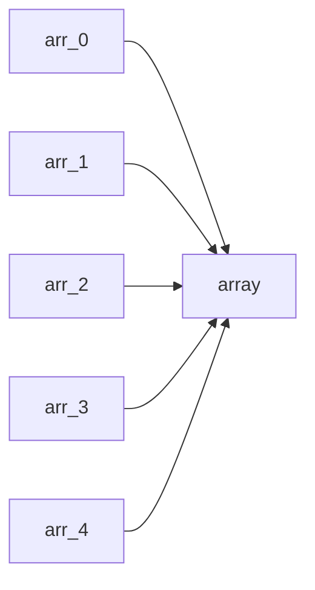

# **程式 筆記**  
## 多維陣列 Multidimesional Array  

```cpp
int arr[100];
```

這是一個簡單的一維陣列  
也就是把一堆 `int` 串再一起  
那如果把一堆 `arr[]` 串再一起，就會變成 **二維陣列**  

其實也可以說是在 **一維陣列** 裡面塞一堆 **一維陣列**  



# 基本架構 Multidimesional Array  

在原先一為陣列的`[]`後面多加一個`[]`，就變成了二維陣列了  

```cpp
int arr[100][100];
```

二維陣列可以簡單想成二維座標，而陣列每個位置則對應著座標點  

|     | &#160;&#160;0&#160;&#160; | &#160;&#160;1&#160;&#160; | &#160;&#160;2&#160;&#160; | &#160;&#160;...&#160;&#160; | 100 |
|:---:|:-------------------------:|:-------------------------:|:-------------------------:|:---------------------------:|:---:|
|  **0**  |                           |                           |                           |                             |     |     |
|  **1**  |                           |                           |                           |                             |     |     |
|  **2**  |                           |                           |                           |                             |     |     |
| **...** |                           |                           |                           |                             |     |     |
| **100** |                           |                           |                           |                             |     |     |

而更高維度的 **$n$維陣列** 其實就是將 **$n-1$維陣列** 塞進 **陣列** 裡  

```cpp
int arr[a1][a2][a3][a4][a5].....[an];
```

然而，多維陣列與一維陣列一樣，都有數量上限  
多維陣列所需的空間就是 $a_1 \times a_2 \times a_3 \times a_4 \times a_5 \times .. \times a_n$  

## 陣列遍歷

可以使用巢狀迴圈來遍歷整個多維陣列  

```cpp
int arr[15][15];
int cnt = 0;
for(int i=0; i<10; i++){
    for(int j=0; j<10; j++){
        arr[i][j]=cnt;
        cnt++;
    }
}
for(int i=0; i<10; i++){
    for(int j=0; j<10; j++){
        cout << arr[i][j] << " ";
    }
    cout << endl;
}
```
`程式碼`
```
0 1 2 3 4 5 6 7 8 9 
10 11 12 13 14 15 16 17 18 19 
20 21 22 23 24 25 26 27 28 29 
30 31 32 33 34 35 36 37 38 39 
40 41 42 43 44 45 46 47 48 49 
50 51 52 53 54 55 56 57 58 59 
60 61 62 63 64 65 66 67 68 69 
70 71 72 73 74 75 76 77 78 79 
80 81 82 83 84 85 86 87 88 89 
90 91 92 93 94 95 96 97 98 99
```
`輸出結果`

## 快樂的練習時間

[TOJ 7](https://toj.tfcis.org/oj/pro/7/)  
[TOJ 114](https://toj.tfcis.org/oj/pro/114/)  
[TOJ 493](https://toj.tfcis.org/oj/pro/493/)  
