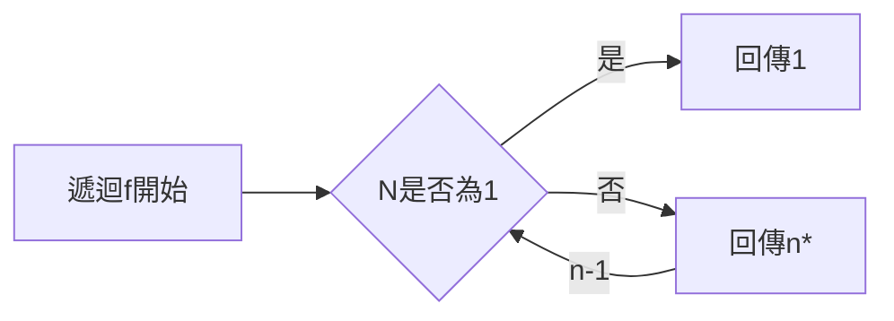
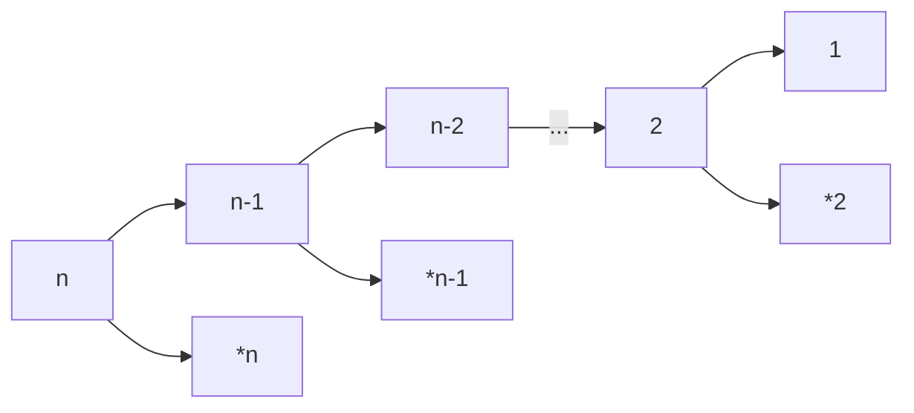
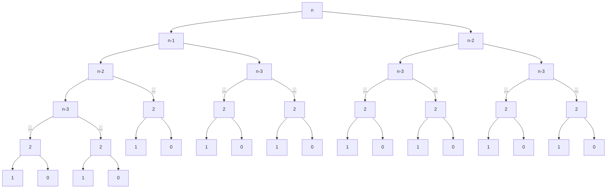

# **程式 筆記**  
## 遞迴 recursion  

遞迴，就是函式自己調用(invoke)自己  
通常被用於解決能夠被分成相似小問題的問題  

以最簡單的階乘為例
$n!=n*(n-1)*(n-2)* \cdots * 1$

```cpp
long long factorial_loop(int n){
    long long result = 1;
    for(int i=1; i<=n; ++i){
        result*=i;
    }
    
    return result;
}
```
將階乘改寫成 $n!=n*(n-1)*(n-2)* \cdots * 1=n*(n-1)!$  
這樣就可以變成遞迴式了，但是如果不設下停止條件，它會無限遞迴下去  
按照階乘的定義 $n=1, 1!=1$  

```cpp
long long factorial_recursion(int n){
    if(n==1){
        return 1;
    }
    return n*factorial_recursion(n-1);
}
```


`流程圖`  


`遞迴概念`  

---

## 費氏數列

已知  
$F_n=F_{n-1} + F_{n-2}$  
$F_0=0, F_1=1$  

```cpp 
int fib(int n) {
    if(n==0){
        return 0;
    }
    if(n==1){
        return 1;
    }
    return fib(n-1)+fib(n-2);
}
```
`程式碼`

`遞迴概念`

---

## 輾轉相除法

----

let r = a % b  
gcd(a, b) = gcd(b, r)  
根據這個就可以寫出遞迴式  

```cpp 
int gcd(int a, int b){
    if(b==0){
        return a;
    }
    
    return gcd(b,a%b);
}
```
`程式碼`

---

## 快樂的練習時間

[toj3](https://toj.tfcis.org/oj/pro/3/)  
[toj49](https://toj.tfcis.org/oj/pro/49/)  
[toj224](https://toj.tfcis.org/oj/pro/224/)  
