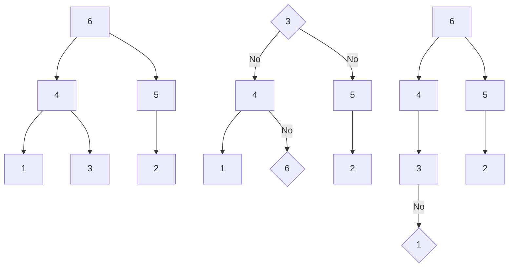
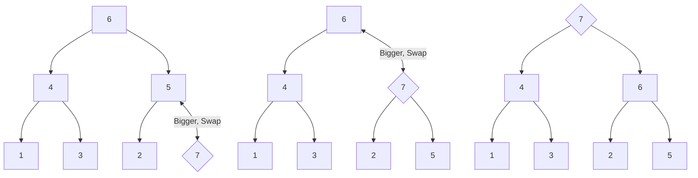
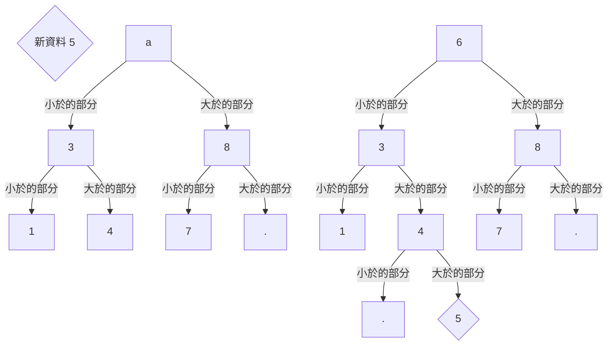
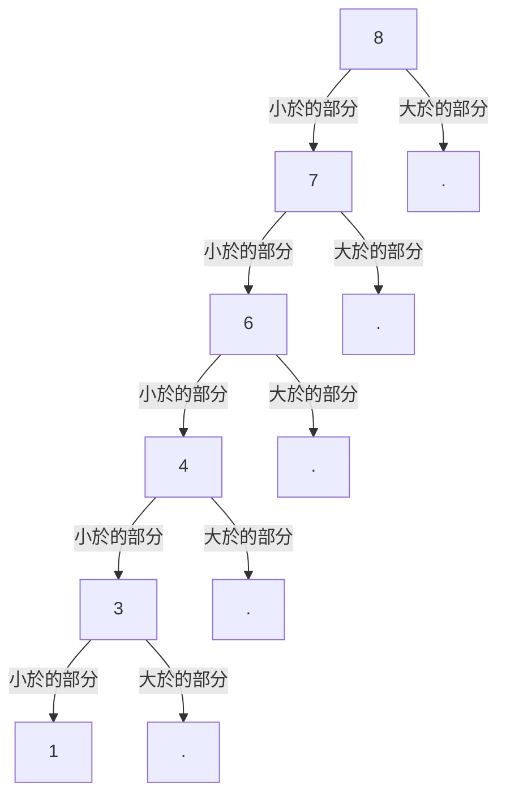

# **C++ 筆記**  
## STL Standard Template Library  

STL 的全名是 Standard Template Library，中文為標準模板庫  
STL 提供了很多方便的容器跟算法，可以省下很多時間  

---

1. 迭代器與型別模板  
2. vector  
3. deque  
4. stack  
5. queue  
6. priority_queue  
7. array  
8. bitset  
9. set/map  
10. unordered_set/map  
11. pair/tuple  

---

## 1. 迭代器與型別模板  

型別模板是相對好理解的東西：它的用途是可以`只需要寫一個通用在所有你想支援的範圍內，就可以自動支援`  

以 vector 為例，如果你想要 vector 裡面裝著 T 這種類型，就只要宣告成  

```cpp
vector<t> name;
```

而迭代器則是可以想像成代表一個位置的東西  
有了它就可以直接存取它代表的元素  

如果你現在有一個迭代器 `iter`：  

* `*iter` 就可以取得這個迭代器的值  
* `++iter` 或 `next(iter)` 就可以取得下一個人  
* `--iter` 或 `prev(iter)` 就可以取得上一個人  
* `iter + k` 就可以取得下 `k` 個人  
* `iter - k` 就可以取得上 `k` 個人  
* `容器.begin()` 就可以取得最前面的人  
* `容器.end()` 就可以取得表示結束的那個人，通常會是最後一個人的下一個人，而他是不能取值的  

但要注意不是每個容器都可以進行這邊所有的操作，要視容器的特性而定  

因為型別模板的關係，迭代器的變數類型名稱通常很長，以 vector 為例  
```cpp
vector<int> v;
...
vector<int>::iterator iter=v.begin();
...
```

這時候就可以讓編譯器自動幫我們抓  
```cpp
vector<int> v;
...
auto iter=v.begin();
...
```

---

## 2. vector

vector 完整宣告應該長得像這樣  
```cpp
vector<_Tp, _Alloc = std::allocator<_Tp>>;
```
* _Tp 是裡面要裝什麼東西  
* _Alloc 是要丟新東西進去的時候，這個東西是怎麼要記憶體的。一般來講不會去碰這個因為內建的就夠好用了，直接省略就可以用內建的  

vector 是一個可以動態變動大小的陣列  
支援隨機存取  
在陣列尾端新增、刪除 $O(1)$  
任意插入、刪除 $O(size)$  
交換兩個內容 $O(1)$  

vector 的原理相當簡單：  
`一開始空間是 1，當不夠用了就要一塊 2 倍大小的空間然後全部搬過去`  

  

所需時間大概就是下圖這樣  

  

這樣整體來講只要 $O(size)$ 就能完成所有在尾端加入的工作，均攤一個元素是 $O(1)$  

原因是總共的成本最多是  
$size + size + \frac{1}{2} \cdot size + \frac{1}{4} \cdot size \cdots \leq 3 \cdot size = O(size)$  

至於刪除跟中間插入就是直接暴力了  

* `v.push_back(k)`：把元素 `k` 加到 `v` 的尾巴，必要時會進行記憶體配置  
* `v.pop_back()`：移除 `v` 尾巴的元素  
* `v.insert(iter, k)`：在 `iter` 位置插入元素 `k`  
* `v.erase(iter)`：移除 `iter` 位置元素  
* `v.erase(star, end)`：移除從 `star` 到 `end` 範圍內的元素  
* `v.clear()`：清空容器 `v` 裡所有元素  
* `v.size()`：回傳目前容器 `v` 的長度  
* `v.empty()`：回傳容器 `v` 是否為空  
* `v[i]`：隨機存取容器 `v` 索引值為 `i` 的元素，跟陣列一樣索引值從 0 開始  

```cpp
vector<int> v={1, 2, 3};
                        // 1, 2, 3
v.push_back(4);
                        // 1, 2, 3, 4
auto iter=v.begin();
v.insert(iter+2,999);
                        // 1, 2, 999, 3, 4
v.pop_back();
                        // 1, 2, 999, 3
v.erase(iter);
                        // 2, 999 ,3
cout<<v.size()<<endl;   // output:3
cout<<v.empty()<<endl;  // output:0
v.erase(iter,iter+2);
                        // 3
v.clear();
                        // 
```

基本上，vector 已經可以當基本的陣列用了，還有更多的功能  
但是缺點是 vector 有些狀況下存取會比普通陣列慢，新增元素常數也稍大，需要稍微小心  

---

## 3. deque

deque 完整宣告應該長得像這樣  
```cpp
deque<_Tp, _Alloc = std::allocator<_Tp>>;
```
* _Tp 是裡面要裝什麼東西  
* _Alloc 是要丟新東西進去的時候，這個東西是怎麼要記憶體的。一般來講不會去碰這個因為內建的就夠好用了，直接省略就可以用內建的  

（跟vector一模一樣）

vector 既然能支援從尾端插入跟刪除，那前端有辦法也支援嗎？  
答案是可以的，這就是 deque 在做的事，他的全名是`double-ended-queue`  
就是一個隊伍，而前面跟後面都可以插入跟刪除  
大致上使用與 vector 差不多  

跟 vector 相同的部分：  
* `dq.push_back(k)`：把元素 `k` 加到 `dq` 的尾巴，必要時會進行記憶體配置  
* `dq.pop_back()`：移除 `dq` 尾巴的元素  
* `dq.insert(iter, k)`：在 `iter` 位置插入元素 `k`  
* `dq.erase(iter)`：移除`iter`位置元素  
* `dq.erase(star, end)`：移除某一段範圍的元素  
* `dq.clear()`：清空容器 `dq` 裡所有元素  
* `dq.size()`：回傳目前容器 `dq` 的長度  
* `dq.empty()`：回傳容器 `dq` 是否為空  
* `dq[i]`：隨機存取容器 `dq` 索引值為 `i` 的元素，跟陣列一樣索引值從 0 開始  

跟 vector 不同的部分：  
* `dq.push_front(k)`：把元素 `k` 加到 `dq` 的頭，必要時會進行記憶體配置  
* `dq.pop_front()`：移除 `dq` 頭的元素  

```cpp
deque<int> dq(3,0);
// 0, 0, 0
dq[1]=3;
// 0, 3, 0
dq.push_front(1);
// 1, 0 ,3 ,0
dq.pop_front();
// 0, 3, 0
```

deque 基本上就是功能很齊全的陣列了  
但是缺點是 deque 的常數約略是 vector 的至少 2 到 3 倍  
在同樣情況下運行時間可能會較慢  

---

## 4. stack  

stack 完整宣告應該長得像這樣  
```cpp
stack<_Tp, _Sequence =deque<_Tp>>;
```
* _Tp 是裡面要裝什麼東西  
* _Sequence 則是我們要用什麼東西裝，預設是 deque，但你可以發現其實 vector 也可以做一樣的是，所以也可以像是  
```cpp
stack<int, vector<int>> st;
```
這樣常數會比較小  

stack 可以算是簡省版的 vector  
也可以看成一堆的東西，但為了怕弄倒所以只能拿最上面那個  

因此 stack 只能看跟拿走最上面那個，或者是放一個新的東西上去  
中間的其他部分因為被其他擋住了所以看不到，所以不能隨機存取  

* `st.push(k)`：將元素 `k` 加到堆疊 `st` 的最上面  
* `st.top()`：查看堆疊 `st` 最上面的元素  
* `st.pop()`：將堆疊 `st` 最上面的元素丟棄  

  

```cpp
stack<int> st;
st.push(1);
// 1
st.push(2);
// st.top()==2
// 1, 2
st.pop();
// 1
```

stack 功用很容易被取代，而且還有帶 deque 的常數  
所以很多人都使用 vector 來取代 stack  

---

## 5. queue

queue 完整宣告應該長得像這樣  
```cpp
queue<_Tp, _Sequence = deque<_Tp>>;
```
* _Tp 是裡面要裝什麼東西  
* _Sequence 則是我們要用什麼東西裝，預設是 deque，但這次 vector 就沒辦法做這件事了，就乖乖用 deque 吧  

queue 就是一半的 deque  
就像一堆人排成一列一樣，前面的人離開後，才輪到後面的人離開  

他只能看跟拿走最上面那個  
或者是放一個新的在後面，中間的不能隨機存取  

* `q.push(k)`：將元素 `k` 加到佇列 `q` 的尾巴  
* `q.front()`：查看佇列 `q` 最前面的元素  
* `q.pop()`：將佇列 `q` 最前面的元素丟棄  

  

```cpp
queue<int> q;
q.push(1);
// 1
q.push(2);
// 1, 2
// q.front()==1
q.pop();
// 2
```  

queue 取代性較低，很多場合還是會用到  

---

## 6. priority_queue  

優先佇列，也就是有優先級的 queue  

假設你現在有很多題目要寫，有些會給你快樂，有些只會讓你抱怨連連  
而你想要先寫那些最能帶給你快樂的  

可是事實並不是題目寫完就沒了，新的題目會一直加進來  
如果你想要每次都寫那個最棒的題目，你要怎麼知道是哪一題？  

假設總共有 $N$ 個題目，每次都要從所有題目裡面找，真的太費時了  
所以我們需要這個東西： priority_queue 可以  

* $O(1)$ 存取最好的  
* $O(log N)$ 插入一個東西  
* $O(log N)$ 把最高的拔掉  

也就是可以在插入的同時，花費 $O(log N)$ 後，保證最好的值在最上面  
這樣會比每次輸入後，都排序一次 $O(N\cdot log N)$ 的時間來排序有效率的多  

priority_queue 的實作是使用二叉堆，他的性質有：  

1. 這堆有一個根，他會是目前最大的元素  
2. 每個人最多有兩個小孩，而每個人的小孩都小於等於他自己  
3. 定義從根不斷往任意小孩走遇到盡頭的最大次數是深度，那這堆的深度會是所有滿足上兩個條件裡面深度最小的  



為了滿足這些性質，我們在插入的時候只要：  

* 找最淺的洞  
* 如果我比我的祖先大，就往上換  

可以發現這樣永遠會讓原本的三個條件都滿足  




每層的點都可以容納上一層的 $2$ 倍，所以 L 層可以容納 $O(2L)$ 個點  
換句話說 $O(N)$ 個點只有 $O(log N)$ 層  
剛剛的操作每次就會讓高度改變 $1$，所以是 $O(log N)$  

* `pq.push(k)`：將元素 `k` 加到優先佇列 `pq` 裡面  
* `pq.top()`：查看優先佇列 `pq` 中最大的元素  
* `pq.pop()`：將優先佇列 `pq` 中最大的元素丟棄  

```cpp
priority_queue<int> pq;
pq.push(5);
// {5}
pq.push(4);
// {5, 4}
pq.push(6);
// {5, 4, 6}
// pq.top()==max{5, 4, 6}==6
pq.pop();
// {5, 4}
// pq.top()==max{5, 4}==5
```

priority_queue 超級實用也超級重要，是不可或缺的 STL 之一  

---

## 7. array

array 就是陣列  

```cpp
array<int, 3> arr={0, 1, 2};
```

array 唯一的優點是可以把陣列直接當作一個東西傳入傳出  

然後他可以做的事情就跟一般的 `int arr[3]` 一樣了  

---

## 8. bitset

bitset 就是 bool 的陣列  

* `bs.flip()`：將 `bs` 中原本為 1 的元素換為 0，將原本為 0 的元素換為 1  
* `bs.count()`：回傳 `bs` 中所有為 1 的元素數量  

```cpp
bitset<10> b1=53;
// b1=0000110101
bitset<10> b2="1111100010";
// b2=1111100010
b1.flip();
// b1=1111001010
// b1.count()==6
b1=b1&b2;
// b1=1111000010
```

bitset 的好處是他可以做大量批次的位元操作，會省下 32 或 64 倍的常數  

他雖然看起來沒什麼用，但是實際上用到不可或缺  

---

## 9. set / map

set 可以維護一堆數字，當插入重複的時候會忽略  
可以刪除，可以尋找某個數字有沒有出現過，而且有自排序功能  

map 則是可以在數字上附帶一個值，讓我們找到這個數字可以直接存取  
假如總共有 $N$ 個數字，插入、刪除、尋找都是 $O(log N)$  

當我們有一個已經排好的陣列，我們在找某個人的時候就可以透過二分搜，抓一個人然後看大於、小於或是等於  
如果我們要做這件事很多次，我們會發現只要固定把搜索的部分蓋出來，就可以在最後多接上去，達到功能了  
這種資料結構我們稱之為二元搜索樹  



然而，我們會發現，如果由大到小插入這個結構，就會導致他退
化成一條鍊  



因此，我們需要使用一些方法來讓樹長的平衡一點，這樣深度就會像二叉堆一樣是 $O(log N)$  

C++ STL 所使用的方法是紅黑樹  

set 可以支援插入與尋找、以及刪除  

* `st.insert(k)`：將元素 `k` 加到集合 `st` 裡面  
* `st.erase(k)`：將集合 `st` 裡面的元素 `k` 移除  
* `st.erase(iter)`：將集合 `st` 裡面位置 `iter` 的元素移除  
* `st.find(k)`：回傳集合 `st` 裡面的元素 `k` 的位置  
* `st.count(k)`：回傳集合 `st` 裡面是否有元素 `k`  
* `st.clear()`：將集合 `st` 裡面的元素清空  
* `st.empty()`：回傳集合 `st` 是否為空  

```cpp
set<int> st;
st.insert(5);
// 5
st.insert(3);
// 3, 5
st.insert(7);
// 3, 5, 7
st.insert(5);
// 3, 5, 7
st.erase(st.find(7));// also st.erase(7)
// 3, 5
for (const auto &i : st) {
    cout << s << " ";
    // 遍歷集合 `st`
}// 3 5
cout << endl;
```

multiset 也支援插入與尋找、以及刪除，會保留重複  

```cpp
multiset<int> st;
st.insert(5);
// 5
st.insert(3);
// 3, 5
st.insert(7);
// 3, 5, 7
st.insert(5);
// 3, 5, 5, 7
st.erase(st.find(5));// also st.erase(7)
// 3, 7
for (const auto &i : st) {
    cout << s << " ";
    // 遍歷集合 `st`
}// 3 7
cout << endl;
```

map 則是除了支援插入與尋找、刪除，還有額外的存值功能  

* `mp.insert({q,k})`：將元素 `k` 加入到字典 `mp` 內，索引值為 `q`  
* `mp.erase(q)`：將字典 `mp` 內索引值為 `q` 的元素移除  
* `mp.clear()`：清空字典 `mp` 內的所有元素  
* `mp.empty()`：回傳字典 `mp` 是否為空  
* `mp.size()`：回傳字典 `mp` 內元素數量  
* `mp[q]`：回傳字典 `mp` 內索引值為 `q` 的元素  

```cpp
map<int, int>mp;
mp.insert({5,9});
// [5]=9
mp[7]=16;
// [5]=9, [7]=16
mp.erase(5);
// [7]=16
```

map 也有 multi 版本，然而過於混亂跟難用  

需要注意的是，他們的迭代器只支援往前一個跟往後一個  
也就是說需要量測兩個之間的距離最壞需要 $O(N)$  

無論如何，set, map 都是很重要的存在  

---

## 10. unordered_set / map

set 的大部分操作都需要 $O(log N)$  

但是 C++ STL 有提供一個 **期望** 是 $O(1)$ 查詢、刪除的儲存結
構，但它犧牲了自排序的性質  

假如我們有 $N$ 個隨機選的數字，把他們用除以 N 的餘數分類  
我們會發現每一類都差不多少，也就是說期望上不用找很多就可以找到我們要的那個人  

所以有這個做法：  

* 開大小為 cN 的 list，c 是某個常數（開 $O(N)$的陣列）  
* 每次都在自己除以 cN 的餘數對應的 list 裡面暴力找自己，如果沒有就在最後面新增  

觀察到剛剛的精隨：我們只要找到一個函式 f，能把任意我們想要存  
的東西 T 丟進去，都輸出一個介於 $[0; cN)$ 的整數就好  

這個東西我們稱之為 Hash（雜湊），它有這個性質：  

* 如果 $T = U$ ， $f(T) = f(U)$  
* 如果 $f(T) = f(U)$，很可能 $T = U$  

如果最後一件事沒發生，也就是 $T \neq U$ 但 $f(T) = f(U)$  
我們稱之為雜湊碰撞  
對於一個好的 Hash，我們希望發生這種事的次數盡量的少  
但這種事在資料在線的進來的話，總不可能永遠不發生  
因此我們才會說這個東西 **期望** 上是好的  
但一定有一個最糟的情況會讓它全部碰撞  

使用上幾乎就跟他們沒有 unordered 的版本相同，只是要注意它沒有排序好  

```cpp
unordered_set<int> st;
st.insert(3);
// 3
st.insert(5);
// 3, 5
st.insert(7);
// 3, 5, 7
st.insert(3);
// 3, 5, 7
st.erase(st.find(7)); // also st.erase(7);
// 3, 5
for(const auto &i : st) {
    cout << s << " ";
    // 遍歷集合 `st`
}// 3 5 or 5 3 because undefined
```

由於這個資料結構僅僅是期望上是好的，而且常數也相當大，所以一般而言不建議使用  

對於預設的 Hash 而言，甚至有的比賽會特別構造測資讓他變成每次操作 $O(N)$  

---

## 11. pair / tuple

假如我們今天想要存點 $(x, y)$ ，那我們就需要把兩個綁起來一起做事  

pair 就給了我們這個功能，而如果要綁 $3$ 個以上就可以用tuple  

### pair：
* `make_pair(a, b)`：將 `a` 和 `b` 兩個元素組成一個pair  
* `p.first`：取得 `p` 內的第一個元素  
* `p.second`：取的 `p` 內的第二個元素  

```cpp
pair<int, char> p;
p=make_pair(1, 'a');
// {1, 'a'}
cout << p.fisrt << " " << p.second << endl;
// 1 a
```

### tuple：
* `make_tuple(a, b, c (...))`：將 `a` , `b` 和 `c` 三個或以上的元素組成一個tuple  
* `get<n>(t)`：取的 `t` 內的第 `n` 個元素  

```cpp
tuple<int, char, bool> t;
t=make_tuple(1, 'a', false);
// {1, 'a', false}
cout << get<0>(t) << " " << get<1>(t) << " " << get<2>(t) <<endl;
// 1 a 0
```

多多用pair跟tuple它可以提升很多寫程式的效率  

偷偷放一個我還不會用tuple的時候的做法  
```cpp
pair< pair<int,int> , int> p;
p=make_pair(make_pair(1,2),3)
/* also
p.first.first=1;
p.first.second=2;
p.second=3;
*/
```


