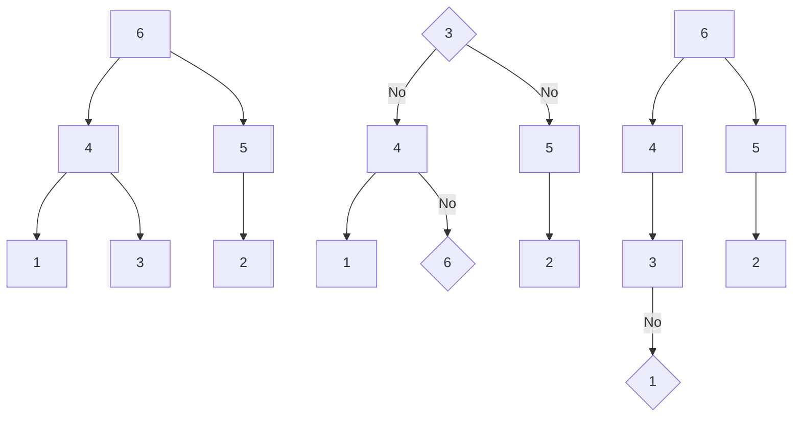

# **C++ 筆記**  
## STL Standard Template Library  

STL 的全名是 Standard Template Library，中文為標準模板庫  
STL 提供了很多方便的容器跟算法，可以省下很多時間  

---

1. 迭代器與型別模板  
2. vector  
3. deque  
4. stack  
5. queue  
6. priority_queue  
7. array  
8. bitset  
9. set/map  
10. unordered_set/map  
11. pair/tuple  

---

## 1. 迭代器與型別模板  

型別模板是相對好理解的東西：它的用途是可以`只需要寫一個通用在所有你想支援的範圍內，就可以自動支援`  

以 vector 為例，如果你想要 vector 裡面裝著 T 這種類型，就只要宣告成  

```cpp
vector<t> name;
```

而迭代器則是可以想像成代表一個位置的東西  
有了它就可以直接存取它代表的元素  

如果你現在有一個迭代器 `iter`：  

* `*iter` 就可以取得這個迭代器的值  
* `++iter` 或 `next(iter)` 就可以取得下一個人  
* `--iter` 或 `prev(iter)` 就可以取得上一個人  
* `iter + k` 就可以取得下 `k` 個人  
* `iter - k` 就可以取得上 `k` 個人  
* `容器.begin()` 就可以取得最前面的人  
* `容器.end()` 就可以取得表示結束的那個人，通常會是最後一個人的下一個人，而他是不能取值的  

但要注意不是每個容器都可以進行這邊所有的操作，要視容器的特性而定  

因為型別模板的關係，迭代器的變數類型名稱通常很長，以 vector 為例  
```cpp
vector<int> v;
...
vector<int>::iterator iter=v.begin();
...
```

這時候就可以讓編譯器自動幫我們抓  
```cpp
vector<int> v;
...
auto iter=v.begin();
...
```

---

## 2. vector

vector 是一個可以動態變動大小的陣列  
支援隨機存取  
在陣列尾端新增、刪除 $O(1)$  
任意插入、刪除 $O(size)$  
交換兩個內容 $O(1)$  

vector 的原理相當簡單：  
`一開始空間是 1，當不夠用了就要一塊 2 倍大小的空間然後全部搬過去`  

  

所需時間大概就是下圖這樣  

  

這樣整體來講只要 $O(size)$ 就能完成所有在尾端加入的工作，均攤一個元素是 $O(1)$  

原因是總共的成本最多是  
$size + size + \frac{1}{2} \cdot size + \frac{1}{4} \cdot size \cdots \leq 3 \cdot size = O(size)$  

至於刪除跟中間插入就是直接暴力了  

* `v.push_back(k)`：把元素 `k` 加到 `v` 的尾巴，必要時會進行記憶體配置  
* `v.pop_back()`：移除 `v` 尾巴的元素  
* `v.insert(iter, k)`：在 `iter` 位置插入元素 `k`  
* `v.erase(iter)`：移除 `iter` 位置元素  
* `v.erase(star, end)`：移除從 `star` 到 `end` 範圍內的元素  
* `v.clear()`：清空容器 `v` 裡所有元素  
* `v.size()`：回傳目前容器 `v` 的長度  
* `v.empty()`：回傳容器 `v` 是否為空  
* `v[i]`：隨機存取容器 `v` 索引值為 `i` 的元素，跟陣列一樣索引值從 0 開始  

```cpp
vector<int> v={1, 2, 3};
                        // 1, 2, 3
v.push_back(4);
                        // 1, 2, 3, 4
auto iter=v.begin();
v.insert(iter+2,999);
                        // 1, 2, 999, 3, 4
v.pop_back();
                        // 1, 2, 999, 3
v.erase(iter);
                        // 2, 999 ,3
cout<<v.size()<<endl;   // output:3
cout<<v.empty()<<endl;  // output:0
v.erase(iter,iter+2);
                        // 3
v.clear();
                        // 
```

基本上，vector 已經可以當基本的陣列用了，還有更多的功能  
但是缺點是 vector 有些狀況下存取會比普通陣列慢，新增元素常數也稍大，需要稍微小心  

---

## 3. deque

vector 既然能支援從尾端插入跟刪除，那前端有辦法也支援嗎？  
答案是可以的，這就是 deque 在做的事，他的全名是`double-ended-queue`  
就是一個隊伍，而前面跟後面都可以插入跟刪除  
大致上使用與 vector 差不多  

跟 vector 相同的部分：  
* `dq.push_back(k)`：把元素 `k` 加到 `dq` 的尾巴，必要時會進行記憶體配置  
* `dq.pop_back()`：移除 `dq` 尾巴的元素  
* `dq.insert(iter, k)`：在 `iter` 位置插入元素 `k`  
* `dq.erase(iter)`：移除`iter`位置元素  
* `dq.erase(star, end)`：移除某一段範圍的元素  
* `dq.clear()`：清空容器 `dq` 裡所有元素  
* `dq.size()`：回傳目前容器 `dq` 的長度  
* `dq.empty()`：回傳容器 `dq` 是否為空  
* `dq[i]`：隨機存取容器 `dq` 索引值為 `i` 的元素，跟陣列一樣索引值從 0 開始  

跟 vector 不同的部分：  
* `dq.push_front(k)`：把元素 `k` 加到 `dq` 的頭，必要時會進行記憶體配置  
* `dq.pop_front()`：移除 `dq` 頭的元素  

```cpp
deque<int> dq(3,0);
// 0, 0, 0
dq[1]=3;
// 0, 3, 0
dq.push_front(1);
// 1, 0 ,3 ,0
dq.pop_front();
// 0, 3, 0
```

deque 基本上就是功能很齊全的陣列了  
但是缺點是 deque 的常數約略是 vector 的至少 2 到 3 倍  
在同樣情況下運行時間可能會較慢  

---

## 4. stack  

stack 可以算是簡省版的 vector  
也可以看成一堆的東西，但為了怕弄倒所以只能拿最上面那個  

因此 stack 只能看跟拿走最上面那個，或者是放一個新的東西上去  
中間的其他部分因為被其他擋住了所以看不到，所以不能隨機存取  

* `st.push(k)`：將元素 `k` 加到堆疊 `st` 的最上面  
* `st.top()`：查看堆疊 `st` 最上面的元素  
* `st.pop()`：將堆疊 `st` 最上面的元素丟棄  

  

```cpp
stack<int> st;
st.push(1);
// 1
st.push(2);
// st.top()==2
// 1, 2
st.pop();
// 1
```

stack 功用很容易被取代，而且還有帶 deque 的常數  
所以很多人都使用 vector 來取代 stack  

---

## 5. queue

queue 就是一半的 deque  
就像一堆人排成一列一樣，前面的人離開後，才輪到後面的人離開  

他只能看跟拿走最上面那個  
或者是放一個新的在後面，中間的不能隨機存取  

* `q.push(k)`：將元素 `k` 加到佇列 `q` 的尾巴  
* `q.front()`：查看佇列 `q` 最前面的元素  
* `q.pop()`：將佇列 `q` 最前面的元素丟棄  

  

```cpp
queue<int> q;
q.push(1);
// 1
q.push(2);
// 1, 2
// q.front()==1
q.pop();
// 2
```  

queue 取代性較低，很多場合還是會用到  

---

## 6. priority_queue  

優先佇列，也就是有優先級的 queue  

假設你現在有很多題目要寫，有些會給你快樂，有些只會讓你抱怨連連  
而你想要先寫那些最能帶給你快樂的  

可是事實並不是題目寫完就沒了，新的題目會一直加進來  
如果你想要每次都寫那個最棒的題目，你要怎麼知道是哪一題？  

假設總共有 $N$ 個題目，每次都要從所有題目裡面找，真的太費時了  
所以我們需要這個東西： priority_queue 可以  

* $O(1)$ 存取最好的  
* $O(log N)$ 插入一個東西  
* $O(log N)$ 把最高的拔掉  

也就是可以在插入的同時，花費 $O(log N)$ 後，保證最好的值在最上面  
這樣會比每次輸入後，都排序一次 $O(N\cdot log N)$ 的時間來排序有效率的多  

priority_queue 的實作是使用二叉堆，他的性質有：  

1. 這堆有一個根，他會是目前最大的元素  
2. 每個人最多有兩個小孩，而每個人的小孩都小於等於他自己  
3. 定義從根不斷往任意小孩走遇到盡頭的最大次數是深度，那這堆的深度會是所有滿足上兩個條件裡面深度最小的  



為了滿足這些性質，我們在插入的時候只要：  

* 找最淺的洞  
* 如果我比我的祖先大，就往上換  

可以發現這樣永遠會讓原本的三個條件都滿足  


