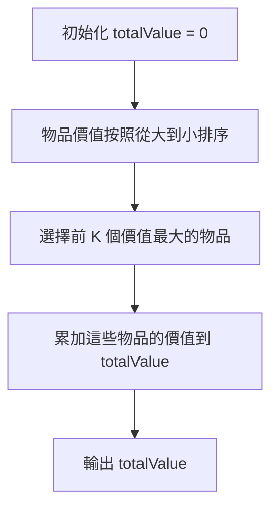
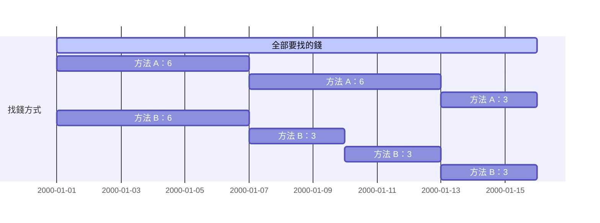
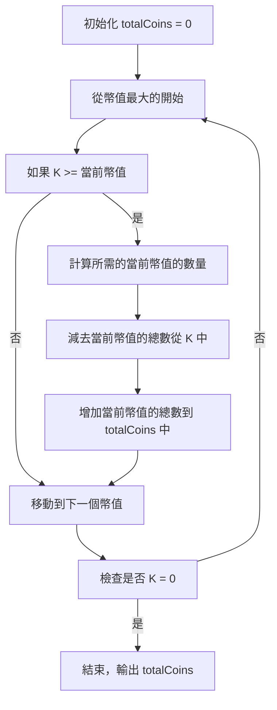
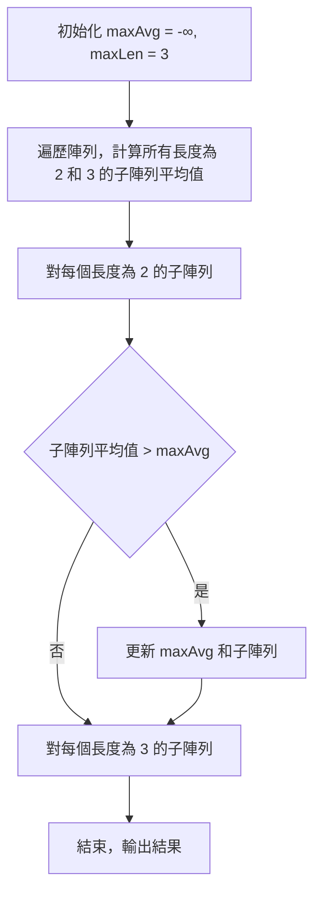
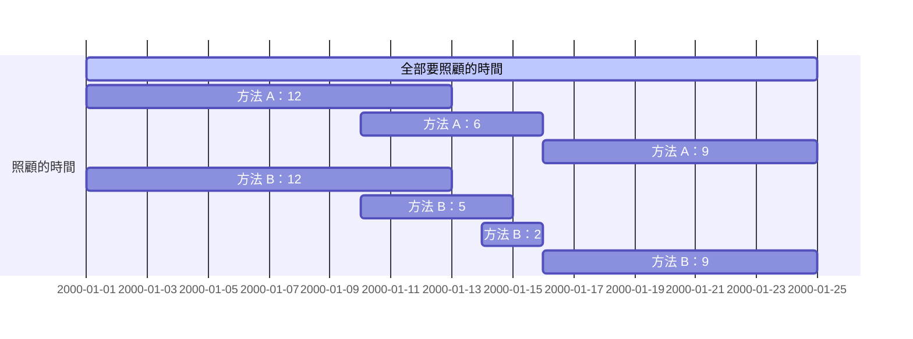
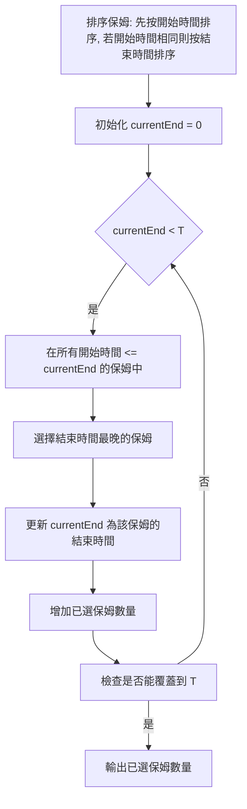

# **C++ 筆記**  
## 貪心 Greedy  

貪心算法，是在每一步選擇中都採取 **當前最佳的選擇** ，希望最終能達到整個問題的最佳解。這種方法基於局部最優選擇，希望能導向全局最優解  

其實也就是在能確保 **未來最佳解** ，必定需要經過 **目前最佳解** 時，便可以使用貪心算法  

## 優點：  

1. 簡單易懂，易於實現  
2. 適用於某些特定類型的問題，如  
     * 活動選擇問題  
     * 最小生成樹問題（如 Kruskal 和 Prim 算法）  
     * 單源最短路徑問題（如 Dijkstra 算法）  

## 缺點：  

1. 不能保證對所有問題都能找到全局最優解  
2. 需要問題本身具有特定性質才能應用  

## 一些 Greedy 範例  

> ### 1. 最基本的 Greedy  
>桌上有 $N$ 個物品，第 $i$ 個物品有價值 $a_i$，你可以拿走 $K$ 個  
>在你想要最大化價值的情況底下，最大是多少？  

最直覺的想法是拿前 $K$ 大的，顯然這也是最好的辦法  
Greedy 的感覺就是訂好一個策略，往當下最好的走，嘗試看看會不會是最好的  

---

> ### 2. 找零錢問題  
> 有 $N$ 種幣值，第 $i$ 種幣值是 $b_i$ ，同時保證：  
> 
> 1. 對於 $1 \leq i < N$ ， 都有 $b_i > b_{i+1}$  
> 2. $b_{i+1}$ 整除 $b_i$  
> 3. $b_N = 1$  
> 
> 今天你是一個超商店員，你想用這些幣值湊出 $K$ 元，但你又不想給顧客太多零錢，因此你想找出零錢總數最少的方法  
> 給定 $N$ , $b_i$ , $K$ 請求出這個最小值是多少  

想想看生活中的解決方式  

從幣值最大的最多的開始嘗試拿，直到拿完為止  
這樣好像是對的，真的是對的嗎？  

我們把兩個不同的方案都按照幣值小的開始排序，定義 $A$ 是剛剛方法做出來的方案 $B$ 是任何其他的方案  

在第一個 $A$ 跟 $B$ 不一樣的地方來看，找 $A$ 的一個一定可以對應到 B 的一部分  

* 如果 $B$ 那部分的第一個比 $A$ 那部分的第一個大呢？  
  不可能發生,因為 $A$ 的策略是「從大的開始試」。  
* 如果 $A$ 的第一個對下去沒有完整的對到一些零錢呢？  
  不可能發生，因為小零錢可以整除大零錢，不可能沒對到。  
  
所以說,我們可以發現 $B$ 在這部分就輸了  
換句話說， $A$ 一定是最好的，Greedy 成功！  

---

> ### 2.ex. 找零錢問題（改）  
> 有 $N$ 種幣值，第 $i$ 種幣值是 $b_i$ ，~~同時保證：~~  
> 
> ~~1. 對於 $1 \leq i < N$ ， 都有 $b_i > b_{i+1}$~~  
> ~~2. $b_{i+1}$ 整除 $b_i$~~  
> ~~3. $b_N$ = $1$~~  
> 
> 今天你是一個超商店員，你想用這些幣值湊出 $K$ 元，但你又不想給顧客太多零錢，因此你想找出零錢總數最少的方法  
> 給定 $N$ , $b_i$ , $K$ 請求出這個最小值是多少  
> 
> 也就是之前保證的三點都不存在了  

那這樣同樣的 Greedy 還有效嗎？  

$N = 3$ ; $b = \{10, 9, 1\}$ ; $K = 27$  
可以發現你會找到一組不好的解  
用原本的方式找錢會找除 $\{10, 10, 1, 1, 1, 1, 1, 1, 1\}$ 共 $9$ 個零錢  
然而用手算一下會發現其實可以用 $\{9, 9, 9\}$ 共 $3$ 個零錢完成任務  
要怎麼解決這個問題？ 之後會講的DP就可以處理這個問題了！

---

> ### 3. 最大平均值問題
> 有一個長度是 $N$ 的陣列 $a$ ，你想要找出一個長度 $> 1$ 個連續子陣列使得他的平均最大  

* 枚舉頭尾 $O(N^2)$ ？  
* 對答案二分搜 $O(N log C)$ ？  
 
有沒有 $O(N)$ 的做法？  

爆搜之後可能會發現，好像答案的長度都不長，只有 $2$ 或 $3$ 而已  
只確定這樣的做法是好的嗎？  

假設陣列 $a = [1, 12, -5, -6, 50, 3]$  

長度為 2 的子陣列：  
* $[1, 12]$ 的平均值是 $6.5$  
* $[12, -5]$ 的平均值是 $3.5$  
* $[-5, -6]$ 的平均值是 $-5.5$  
* $[-6, 50]$ 的平均值是 $22$  
* $[50, 3]$ 的平均值是 $26.5$  

長度為 3 的子陣列：  
* $[1, 12, -5]$ 的平均值是 $2.67$  
* $[12, -5, -6]$ 的平均值是 $0.33$  
* $[-5, -6, 50]$ 的平均值是 $13$  
* $[-6, 50, 3]$ 的平均值是 $15.67$  

根據這個結果，我們可以說長度小於等於 $3$ 的子陣列就能找到最大平均值，這是因為較長的最佳子陣列必定包含一個更短的最佳子陣列  

這樣的方法是有效的，並且時間複雜度是 $O(N)$ ，因為我們只需要遍歷一次陣列，計算所有長度為 $2$ 和 $3$ 的子陣列的平均值  

因此，對任意長度大於 $4$ 的最佳解，我們一定可以把它剖成兩半，拿平均最大的那邊  

也就是說，如果有大於 $4$ 的長度最佳解，那一定有長度小於等於 $3$ 的最佳解  

---

> ### 4. 保母問題
> 寶寶需要全天候的照顧，但是保姆卻不能全天候的工作  
> 有 $N$ 個保姆，第 $i$ 個可以在 $[Xi; Yi]$ 的時間照顧寶寶  
> 你最少需要聘請多少的保姆才能照顧好寶寶(或根本不可能)？  

1. 如果一個保姆很能工作，就優先請他？

反例:  
$N=3$ ; $(X;Y)= \{ (1; 1) ; (2; 109) ; (3; 109) \}$  
這樣會聘請到 $2$ $;$ $3$ $;$ $1$ ，但實際上後面 $2$ 個只需要其中 $1$ 個  

2. 假如把包含的都刪掉呢？

反例:  
$N = 5$ ; $(X;Y) = \{ (1;6) ; (2;7) ; (3;8) \}$  
在大家都一樣的時候，我們不知道要選哪個優先  

3. 重新觀察一遍:

時間 $1$ 一定有人需要來顧，所以我們先找顧的到 $1$ 的最好的那個  
接下來呢？

如果只是單純選能做最久的，我們會像剛剛一樣找到不是很好的解  

如果是找做最晚的呢？似乎就可以了... 嗎？

我們把兩個不同的方案都列出來看，定義 $A$ 是我們剛剛方法做出來的方案， $B$ 是任何其他的方案。

在第一個 $A$ 跟 $B$ 不一樣的地方來看，我們一定會發現 $A$ 比 $B$ 不來的差  

* 如果 $B$ 那部分的第一個比 $A$ 那部分的第一個長呢？  

不可能發生，因為 $A$ 的策略是「從當下可以做最晚的開始試」  

* 如果 $B$ 那部分比 $A$ 那部分用的還要少呢？  

不可能發生，因為 $A$ 第一個在比 $B$ 更長的情況下， $A$ 是有辦法接上 $B$ 的那組解的，因為我們選的比 $B$ 那組解至少在下一步會找到可以做更晚的，如此反覆下去 $B$ 是沒有機會贏過 $A$ 的  

也就是說,剛剛的 Greedy 策略是好的，而且可以很輕鬆的用維護，總時間複雜度 $O(N \cdot log N)$  
我們重新思考一下構建這個策略的關鍵：「觀察到如果處理完 $[1; i]$ 之後，重點在 $i + 1$ 一定要有人顧」  

---

> ### 4.ex. 保母問題（改）
> 寶寶需要全天候的照顧，但是保姆卻不能全天候的工作  
> 有 $N$ 個保姆，第 $i$ 個可以在 $[Xi; Yi]$ 的時間照顧寶寶  
> 而聘請他需要花費 $w_i$  
> 你最少需要花費多少錢才能照顧好寶寶(或根本不可能)？  

剛剛的 Greedy 策略現在已經不管用了，因為可能可以做很晚的很貴，但做一點點的便宜到爆炸  

這個問題該怎麼解決呢？  

沒錯，又是之後會講的DP就可以處理這個問題了！  

---

> ### 5. 最大不相交線斷問題
> 電影季要開跑了！在這場電影季中有 $N$ 部電影，第 $i$ 部播放的時間是 $[a_i; b_i]$  
> 在一個時間點你只能看一部電影，你最多能完整地看完多少部電影？

如果有很多部電影接下來可以看，要選擇哪一部？  

如果選最早開始的，可能會踩到電影其實超長的雷  
如果選最短的，可能會踩到電影超晚開始的雷  
如果選最晚結束的，是不是就做完了？  

我們把兩個不同的方案都列出來看，定義 $A$ 是我們剛剛方法做出來的方案， $B$ 是任何其他的方案。  
在第一個 $A$ 跟 $B$ 不一樣的地方來看，我們一定會發現 $A$ 比 $B$ 不來的差。  

* 如果 $B$ 那部分的第一個比 $A$ 那部分的第一個早結束呢？  
不可能發生，因為 $A$ 的策略是「從當下最早結束的開始看」  

* 如果 $B$ 那部分比 $A$ 那部分看的還要多呢？  
不可能發生，因為 $A$ 第一個在比 $B$ 更早結束的情況下， $A$ 是有辦法接上 $B$ 的那組解的，因為我們選的比 $B$ 那組解至少在下一步會找到一樣好的，如此反覆下去 $B$ 是沒有機會贏過 $A$ 的  

換句話說，這樣的 Greedy 是成功的！  

總時間複雜度 $O(N log (N))$  

