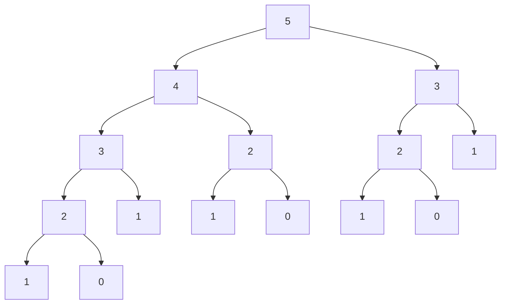
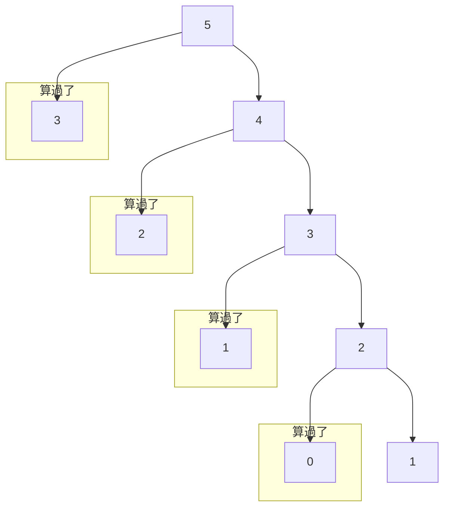

# **C++ 筆記**  
## 動態規劃 DP  

DP、Dynamic Programming，也就是動態規劃，是一種通過把原問題分解為相對簡單的子問題，求解複雜問題的方法  

動態規劃常常適用於有重疊子問題和最佳子結構性質的問題  

---

### 重疊子問題  

> ex. 爬樓梯  
> 你現在在第 $0$ 階，你要走到第 $N$ 階  
> 而每次你可以往上 $1$ 步或 $2$ 步  
> 問總共有多少種方法？  

根據題目，可以推論出以下三點  
* $f(N)=f(N-1)+f(N-2)$  
* $f(0)=1$  
* $f(1)=1$  

```cpp
int f(int n){
    if(n<=1){
        return 1;
    }
    else{
        return f(n-1)+f(n-2);
    }
}
```

雖然看起來十分合理，但其實他的運行效率不佳  

例如，但在 $N$ 是 $40$ 的時候答案就高達 $165580141$ 了  

在算 $f(5)$ 的時候，會呼叫以下的遞迴：  



但我們發現到，其實有很多時候我們重算了一些東西  
而這些東西不管什麼時候算都長一樣  

那如果我們把算過的都存起來，實際上的狀況會多好？  



每個人都只會需要算 $1$ 次，所以要算 $f(N)$ 只需要 $O(N)$ 的時間  
如果再更進一步發現，當我們算好 $f(N-1),f(N-2)$ 就可以算 $f(N)$ 了  
只要從 $2$ 開始算到 $N$ ，就可以用陣列跟迴圈把答案算完  

```cpp
int f[100];
int calcf(int n){
    f[0]=1;f[1]=1;
    for(int i=2; i<=n; i++){
        f[i]=f[i-1]+f[i-2];
    }
    return f[n];
}
```

這就是 DP 的第一個精神：重複的子問題不要再做  

---

### 最佳子結構  

最佳子結構指的是，我們可以在一些狀況底下，只保留最佳的決策  
這樣在整個問題解決之後，得到的還是一種最佳的結果  

> ex. 背包問題
> 你有 $N$ 個物品跟一個可以裝下重量 $W$ 的背包，每個物品有重量 $w_i$ 跟價值 $v_i$  
> 在背包裡的總重量 $W$ 的條件下，最大化總價值  
> $1 \leq N \leq 100; 1 \leq W \leq 10^5; 1 \leq v_i \leq 10^9$  

在這樣的情況底下，我們可以觀察到在考慮完一些物品的當下  
所有已經裝了重量是 $w$ 的方法中，我們只在乎最大的價值 $v$ 可以是多少  
再更進一步我們發現，我們可以把一堆一堆的方案壓縮成這個東西：  

$dp(i; j)$ ：考慮完前 $i$ 個物品，重量是 $j$ 的最大價值  

這個就稱為最佳子結構  

這裡有個前提是 DP 不能有後效性，也就是說被我們壓縮起來的東西  
不能影響後面的決策，否則我們就可能要把他考慮在我們壓縮的東西裡面  

---

### 狀態、轉移與基底  

DP 的核心概念不外乎三個東西：  

* 列狀態  
哪些樣子的東西可以一起考慮？或是要算的答案跟甚麼有關？  
* 定轉移  
要怎麼表達題目要的東西？模擬過程？  
* 找基底  
一開始的狀態是什麼？有點像遞迴的終止條件  

這樣講可能還是有點抽象，所以我們先回到剛剛那題來看 DP 是怎麼運作的  

> ex. 背包問題
> 你有 $N$ 個物品跟一個可以裝下重量 $W$ 的背包，每個物品有重量 $w_i$ 跟價值 $v_i$  
> 在背包裡的總重量 $\leq W$ 的條件下，最大化總價值  
> $1 \leq N \leq 100; 1 \leq W \leq 10^5; 1 \leq v_i \leq 10^9$  

* 列狀態  

我們剛剛觀察到在考慮完一些物品的當下，所有已經裝了重量是 $w$ 的方法中，我們只在乎最大的價值 $v$ 可以是多少  

再更進一步我們發現，我們可以把一堆一堆的方案壓縮成這個東西：  

$dp(i; j)$ ：考慮完前 $i$ 個物品，重量是 $j$ 的最大價值  

這時候的 $dp(i; j)$ 就稱做**狀態**  

* 定轉移  

我們要怎麼讓算出來的東西是考慮所有物品之後的最大價值？  

考慮完前 $i$ 個物品，重量是 $j$ 的最大價值的來源只有兩個選擇：  
拿跟不拿第 $i$ 個物品  

$dp(i; j) = max\{dp(i-1; j); dp(i-1; j+w_i)\}$  

這時候的關係式就稱作**轉移**  

* 找基底

在剛剛的轉移式裡面，如果直接遞迴下去，我們會發現我們少了終止條件  

這時候我們可以往兩個地方想：全部都是空的狀態定義是什麼？  
有沒有轉移會戳出無效的狀態？  

在這題裡面，全部都是空的狀態就是 $dp(0; 0) = 0$  

而無效的狀態則是 $dp(0; j); (j \neq 0)$ 以及 $dp(i; j); (j < 0)$  
在這題要最大化的前提下，我們可以把它設成 $-\infty$  

這就是所謂的**基底**  

如此一來我們就可以寫出下列的程式：  

```cpp
int dp(int i, int j){
    if(i==0 && j==0){
        return 0;
    }
    else if(i==0 || j<0){
        return -1e11;
    }
    else{
        return max(dp(i-1, j), dp(i-1, j-w[i]));
    }
}
```

如此一來,算出 $max_{j \leq w} dp(N; j)$ 就會得到答案了  

但我們發現，我們沒有用到 DP 的第一個精神：**重複子問題**  
使用之後，所有狀態下的 dp 值都只會被計算到一次，每次耗時 $O(1)$ ，總複雜度 $O(NW)$  

```cpp
int dp[105][100005];
bool used[105][100005];
int dp(int i, int j){
    if(i==0 && j==0){
        return 0;
    }
    else if(i==0 || j<0){
        return -1e11;
    }
    if(!used[i][j]){
        used[i][j]=1;
        dp[i][j]=max(dp(i-1, j), dp(i-1, j-w[i]));
    }
    return dp[i][j];
}
```

剛剛我們已經成功寫出了第一個方法：Top-down 的 DP 計算方法，也就是單純利用遞迴  

現在要介紹另一種實作方式： Bottom-up 的計算方法  

觀察到一件事:當所有 $i' \leq i; j' \leq j$ 的狀態 $dp(i'; j')$ 都被算好了  
之後就可以放心地算 $dp(i; j)$ 了  

所以我們也可以直接用兩層迴圈依序把 $i、j$ 都用遞增的順序跑過去，就能直接在陣列上做事了  

```cpp
int dp[105][100005];
dp[0][0]=0;
for(int i=1; i<=100000; i++){
    dp[0][i]=-1e11;
}
for(int i=1; i<=N; i++){
    for(int j=0; j<=W;j++){
        if(j>=w[i]){
            dp[i][j]=max(dp[i-1][j], dp[i-1][j-w[i]]);
        }
        else{
            dp[i][j]=dp[i-1][j];
        }
    }
}
```

這樣的好處是可以省去遞迴的部分，常數會變的小很多  

但是，我們要怎麼確定這樣做出來的 $max_{j \leq W} dp(N; j)$ 就一定是考慮所有狀態下的最佳解呢？  

我們可以發現，對於一個方案依序決定前 $N$ 個物品要不要拿，總和是 $W_0 \leq W$ 的方案，他一定會被這樣的轉移路徑考慮到：  

* 如果第 $i$ 個物品有拿  
設當前重量是 $w$ ，那就會是 $dp(i-1; w-w_i) \rightarrow dp(i; w)$  

* 如果第 $i$ 個物品沒拿  
設當前重量是 $w$ ，那就會是 $dp(i-1; w) \rightarrow dp(i; w)$  

可以發現路徑上一定會被我們的程式考慮到，所以要不是他是最佳解，就是被某次取 max 打爆了  

我們希望算出來的 $dp(N; W)$ 就是最佳解了，那對於總重是 $W' < W$ 的方案，我們可以做什麼調整？  

這時候可以直接幫它們補一個重量是 $W-W'$ 、價值是 $0$ 的物品  
對這些物品我們還要再直接一起轉移嗎？  
答案是不用,我們只需要好好修改一下基底就好了：  
把所有 $dp(0; j);(j>0)$ 都設成 $0$  
這樣實作會更簡單一點：  

```cpp
int dp[105][100005];
for(int i=1; i<=N; i++){
    for(int j=0; j<=W; j++){
        if(j>=w[i]){
            dp[i][j]=max(dp[i-1][j], dp[i-1][j-w[i]]);
        }
        else{
            dp[i][j]=dp[i-1][j];
        }
    }
}
```

到此就是 DP 最基礎的想法了  

---

## 一些例題  

> [TOJ470](https://toj.tfcis.org/oj/pro/470/)  
> 給出 $N$ 個數字 $V_i$ ，可以自由選擇取與不取，然而規定取數字時不得連續  
> 求可得數字和的最大值  
> $1 \leq N \leq 1,000,000$  
> $| V_i | ≤ 1000$  

怎麼樣的情況可以被我們壓縮成同一個情況來討論？  

錯誤的狀態舉例：  
$dp_i$ 表示前 $i$ 組數字可獲得的最大值  

為什麼錯呢？因為如果將所有狀態壓縮  
這樣就會損失另一個重要資訊 **上一個數字是否有拿過**  

例如有一數組：  
> $1 \quad 3 \quad 1 \quad 3 \quad 2$  

如果照上面說的狀態壓縮，會變成  
> $1  \quad ?$  

第二個數字就不知道能不能拿了  
如果拿了，變成 $1 \quad 4$ ，那就違反了題目的規則  
但如果不拿， $0 \quad 3$ ，明明就是相對較好的結果  

所以，我們可以列出這樣的狀態：  
$dp_{i,j}$ 表示前 $i$ 組數字可獲得的最大值， $j=1$ 代表有拿數字， $j=0$ 代表沒拿數字  

轉移的部分就簡單很多，只要照著這樣的規則：  

$dp_{i\ ,\ 0} \quad = \quad max(\ dp_{i-1\ ,\ 0} \ , \  dp_{i-1\ ,\ 1}\ )$  
$dp_{i\ ,\ 1} \quad = \quad max(\ dp_{i-1\ ,\ 0} \ , \ dp_{i\ ,\ 1})\ + V_i$  

基底的部分也相對簡單比較多  
就是第一天有拿與沒拿而已  

$dp_{0\ ,\ 0} \quad = \quad 0$  
$dp_{0\ ,\ 1} \quad = \quad V_0$  

綜合三點，不難發現這樣就會涵蓋到所有方案了，也恰好排除掉了不合法的方案  

所以這樣 DP 出來就是對的結果了  

```cpp
#include<bits/stdc++.h>
using namespace std;

int v[1000005],dp[1000005][2];

int main(){
    int n;
    while(cin>>n){
    	for(int i=0; i<n; i++){
    		cin>>a[i];
    		dp[i][0]=0;
            dp[i][1]=0;
    		if(i==0){
    			dp[0][1]=a[0];
			}
			else{
				dp[i][0]=max(dp[i-1][0],dp[i-1][1]);
				dp[i][1]=max(dp[i-1][0]+a[i],dp[i-1][1]);
			}
		}
		cout << max(dp[n-1][0], dp[n-1][1]) << endl;
	}
}
```


