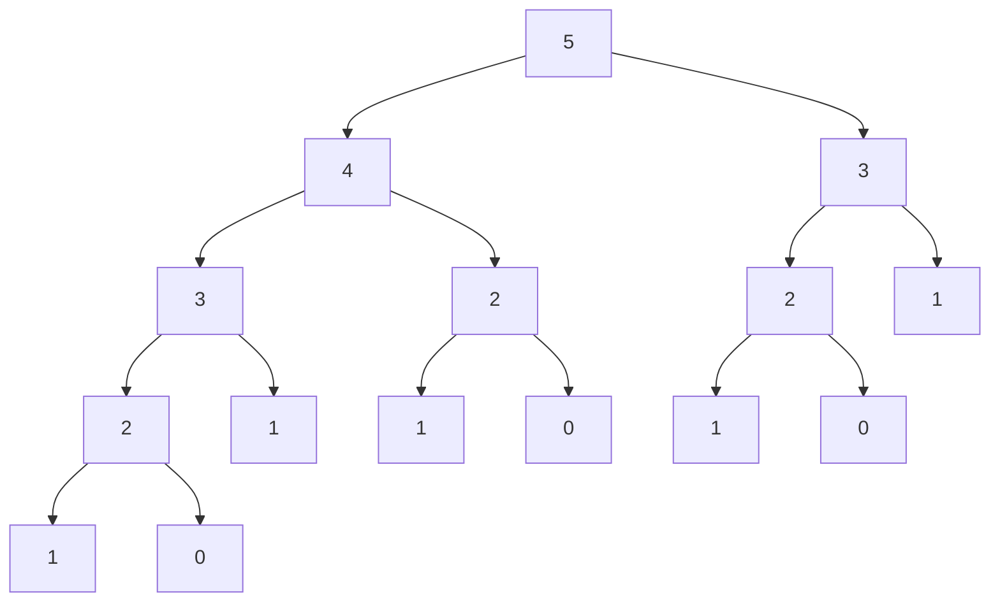
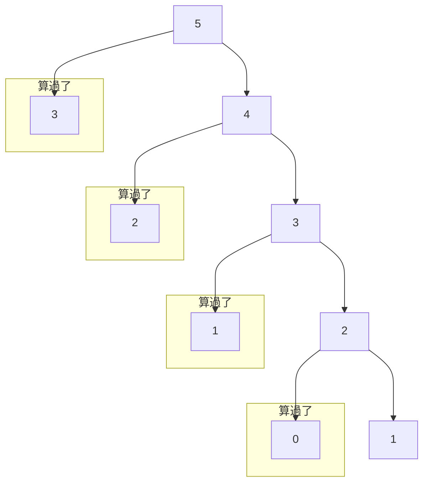

# **C++ 筆記**  
## 動態規劃 DP  

DP、Dynamic Programming，也就是動態規劃，是一種通過把原問題分解為相對簡單的子問題，求解複雜問題的方法  

動態規劃常常適用於有重疊子問題和最佳子結構性質的問題  

---

### 重疊子問題  

> ex. 爬樓梯  
> 你現在在第 $0$ 階，你要走到第 $N$ 階  
> 而每次你可以往上 $1$ 步或 $2$ 步  
> 問總共有多少種方法？  

根據題目，可以推論出以下三點  
* $f(N)=f(N-1)+f(N-2)$  
* $f(0)=1$  
* $f(1)=1$  

```cpp
int f(int n){
    if(n<=1){
        return 1;
    }
    else{
        return f(n-1)+f(n-2);
    }
}
```

雖然看起來十分合理，但其實他的運行效率不佳  

例如，但在 $N$ 是 $40$ 的時候答案就高達 $165580141$ 了  

在算 $f(5)$ 的時候，會呼叫以下的遞迴：  



但我們發現到，其實有很多時候我們重算了一些東西  
而這些東西不管什麼時候算都長一樣  

那如果我們把算過的都存起來，實際上的狀況會多好？  



每個人都只會需要算 $1$ 次，所以要算 $f(N)$ 只需要 $O(N)$ 的時間  
如果再更進一步發現，當我們算好 $f(N-1),f(N-2)$ 就可以算 $f(N)$ 了  
只要從 $2$ 開始算到 $N$ ，就可以用陣列跟迴圈把答案算完  

```cpp
int f[100];
int calcf(int n){
    f[0]=1;f[1]=1;
    for(int i=2; i<=n; i++){
        f[i]=f[i-1]+f[i-2];
    }
    return f[n];
}
```

這就是 DP 的第一個精神：重複的子問題不要再做  

---

### 最佳子結構  

最佳子結構指的是，我們可以在一些狀況底下，只保留最佳的決策  
這樣在整個問題解決之後，得到的還是一種最佳的結果  

> ex. 背包問題
> 你有 $N$ 個物品跟一個可以裝下重量 $W$ 的背包，每個物品有重量 $w_i$ 跟價值 $v_i$  
> 在背包裡的總重量 $W$ 的條件下，最大化總價值  
> $1 \leq N \leq 100; 1 \leq W \leq 10^5; 1 \leq v_i \leq 10^9$  

在這樣的情況底下，我們可以觀察到在考慮完一些物品的當下  
所有已經裝了重量是 $w$ 的方法中，我們只在乎最大的價值 $v$ 可以是多少  
再更進一步我們發現，我們可以把一堆一堆的方案壓縮成這個東西：  

$dp(i; j)$ ：考慮完前 $i$ 個物品，重量是 $j$ 的最大價值  

這個就稱為最佳子結構  

這裡有個前提是 DP 不能有後效性，也就是說被我們壓縮起來的東西  
不能影響後面的決策，否則我們就可能要把他考慮在我們壓縮的東西裡面  

---

### 狀態、轉移與基底  

DP 的核心概念不外乎三個東西：  

* 列狀態  
哪些樣子的東西可以一起考慮？或是要算的答案跟甚麼有關？  
* 定轉移  
要怎麼表達題目要的東西？模擬過程？  
* 找基底  
一開始的狀態是什麼？有點像遞迴的終止條件  

這樣講可能還是有點抽象，所以我們先回到剛剛那題來看 DP 是怎麼運作的  

> ex. 背包問題
> 你有 $N$ 個物品跟一個可以裝下重量 $W$ 的背包，每個物品有重量 $w_i$ 跟價值 $v_i$  
> 在背包裡的總重量 $\leq W$ 的條件下，最大化總價值  
> $1 \leq N \leq 100; 1 \leq W \leq 10^5; 1 \leq v_i \leq 10^9$  

* 列狀態  

我們剛剛觀察到在考慮完一些物品的當下，所有已經裝了重量是 $w$ 的方法中，我們只在乎最大的價值 $v$ 可以是多少  

再更進一步我們發現，我們可以把一堆一堆的方案壓縮成這個東西：  

$dp(i; j)$ ：考慮完前 $i$ 個物品，重量是 $j$ 的最大價值  

這時候的 $dp(i; j)$ 就稱做**狀態**  

* 定轉移  

我們要怎麼讓算出來的東西是考慮所有物品之後的最大價值？  

考慮完前 $i$ 個物品，重量是 $j$ 的最大價值的來源只有兩個選擇：  
拿跟不拿第 $i$ 個物品  

$dp(i; j) = max\{dp(i-1; j); dp(i-1; j+w_i)\}$  

這時候的關係式就稱作**轉移**  


