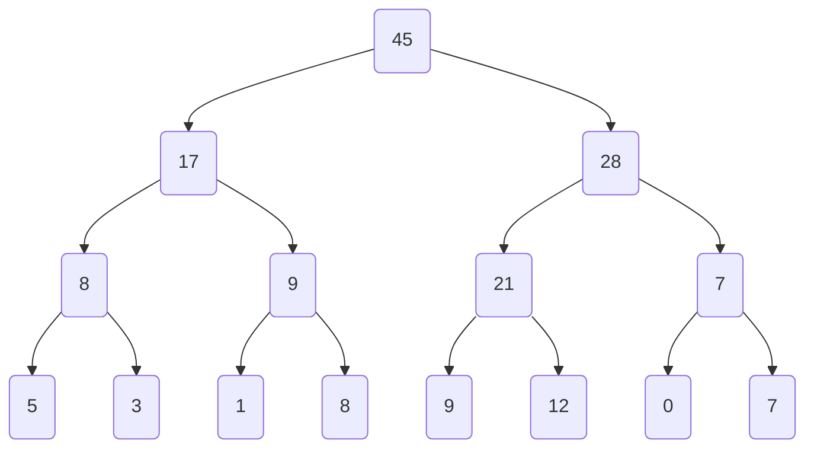
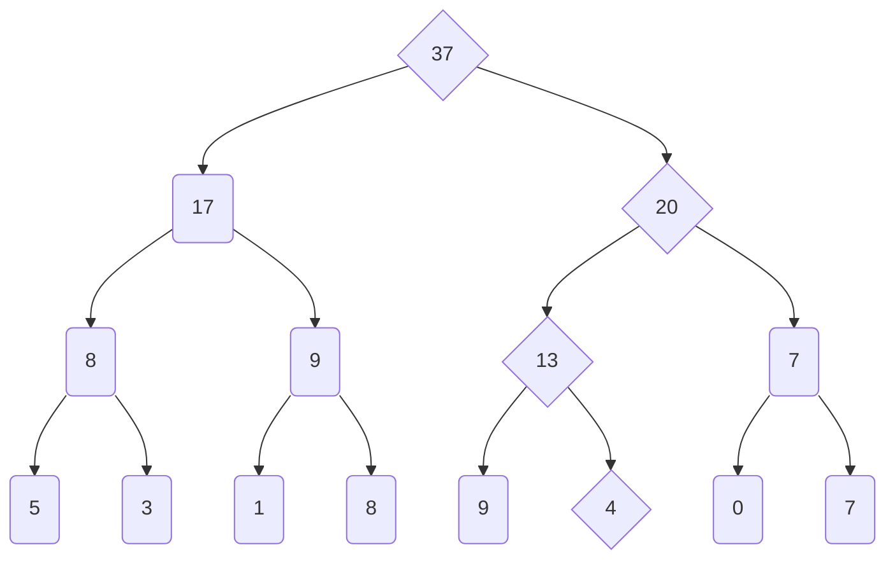
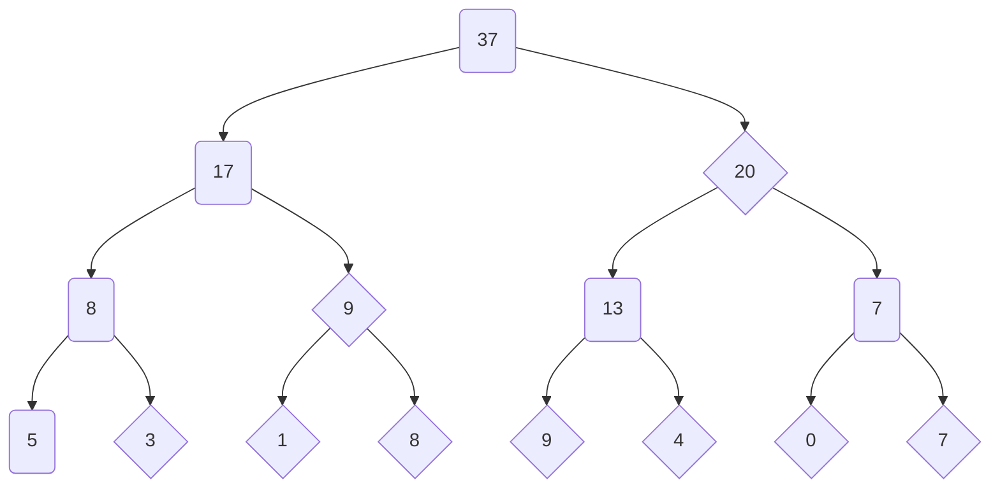

# **C++ 筆記**  
## 資料結構 Data Structure  

資料結構的用途就是把資料存在設計好的結構裡面  
方便快速達成我們的某些要求  

* 單調隊列  
* 前綴和與差分  
* Sparse Table  
* 分塊  
* 線段樹  
* BIT  

## 1. 單調隊列  

> ### ex1. 經典問題
> 給定一個長度為 $N$ 的陣列 $A$ ，給定一個長度 $K$  
> 對所有 $i = 1, 2, \cdots , N$  
> 輸出 $max_{(i \leq j \leq i+k-1)}A_j$  
> $1 \leq K \leq N \leq 10^6$  

範例：  
$A = \{1, 5, 4, 7, 6, 3, 2, 8\}, K = 3$  
Output = $\{5, 7, 7, 7, 6, 8\}$  

觀察：  
當我們從左往右算過去的時候  
如果 $i < j$ 且 $A_i \leq Aj$ ，那 $A_j$ 比 $A_i$ 來的「更有用」  

定義「沒有用」的就是他在當前範圍內有人比他更有用  
只要好好把這些刪掉，就會有這個條件：  

$i < j \rightarrow A_i > A_j$  

換句話說，一個區間的答案就是他最前面有用的人  

怎麼只維護一個區間內有用的人？  

1. $\{10, 9, 4, 3, 1\} \leftarrow 5$  
2. $\{10, 9, 4, 3\} \leftarrow 5$  
3. $\{10, 9, 4\} \leftarrow 5$  
4. $\{10, 9\} \leftarrow 5$  
5. $\{10, 9, 5\}$  

最前面的人也可能會過期，所以遇到最前面的過期就把他 pop 掉  
這樣會不會導致隊列是空的？  

ans：不可能，因為後面的人至少有一個  

---

## 2. 前綴和與差分  

> ### ex2. 靜態區間和  
> 給定一個長度為 $N$ 的陣列 $A$ ， $Q$ 筆詢問 $\Sigma^{R}_{i=L}A_i$  
> $1 \leq N, Q \leq 10^6$  

$O(NQ)$ 會 TLE，怎麼辦？  
做更簡單一點的事：  

如果 $S_i$ 表示 $A_1 + A_2 + \cdots + A_i$ ，這樣我們就有  
$S_i = S_{i-1} + Ai$  

$O(N)$ 算完，每個查詢 $O(1)$ 回答  
我們稱 $S$ 陣列是 $A$ 陣列的前綴和  

$A_L + A_{L+1} + \cdots + A_R = S_R-S_{L-1}$  

用同樣的方法 $O(N)$ 算完，每個查詢 $O(1)$ 回答  

> ### ex3. 區間修改  
> 給定一個長度為 $N$ 的陣列 $A$ ，接下來有 $Q$ 筆修改：  
> 把 $A_L, A_{L+1}, \cdots , A_R$ 都加上 $C$ ，最後輸出陣列 $A$ 經過全部修改後的樣子  
> $1 \leq N, Q \leq 10^6$  

如果 $A$ 是原本的陣列， $S$ 是他的前綴和  
當 $A_i$ 是 $C$ 的時候  
$Si , Si+1 , \cdots , S_N$ 都會因為 $A_i$ 的影響而多出了 $C$  

利用這個性質，對於每一筆詢問，我們可以把 $A_L$ 加上 $C$  
把 $A_{R+1}$ 扣掉 $C$ ，這樣就能最後一起做前綴和達到我們的目的  

誰的前綴和是 $A$ ？  
假設 $D$ 的前綴和是 $A$ ，則  

$A_i = A_{i-1} + D_i$  

我們稱 $D$ 陣列是 $A$ 陣列的差分  

> ### ex4. 二為前綴和  
> 給定一個大小為 $n \times n$ 的表格，有些格子上有樹  
> $q$ 筆詢問 $(x1, y1)$ 到 $(x2, y2)$ 之間有多少樹  
> $1 \leq n \leq 1000; 1 \leq q \leq 2 \times 10^5$  

同樣的，如果我們想用一樣的技巧，就會有  
$S_{I,J}=\Sigma^{I}_{i=0} \Sigma^{J}_{j=0}A_{i,j}$  

  

$S_{i,j}=A_{i,j}+S_{i-1,j}+S_{i,j-1}-S_{i-1,j-1}$  

查詢？  

  

$\Sigma^{x_2}_{i=x_1}\Sigma^{y_2}_{j=y_1}A_{i,j}=S_{x_2,y_2}-S_{x_1-1,y_2}-S_{x_2,y_1-1}+S_{x_1-1,y_1-1}$  

也就是說，這題可以單純使用前綴和在 $O(n^2 + q)$ 的時間內解決  

實際上前綴和跟差分的技巧可以推廣到任意 $D$ 維,但查詢跟建構的時間就需要多乘上 $2^D$  

---

## 3. Sparse Table  

Sparse Table 的中文是稀疏表，縮寫作 ST 但這個名稱很常跟其他簡寫搞混  

> ### ex.5 靜態區間最大值  
> 給定一個長度為 $N$ 的陣列 $A,Q$ 筆詢問  
> $max \  \{ A_L, A_{L+1}, \cdots, A_R \}$  
> $1 \leq N, Q \leq 2 \times 10^5$  

可以用前綴的技巧嗎？  

定義 $S_i = max \  \{ A_1, A_2, \cdots, A_i \}$  
當我們知道所有的 $S_i$ ，能夠快速反推 $max \  \{ A_L, A_{L+1}, \cdots, A_R \}$ 嗎？  

不行，因為 $max$ 操作不像 $+$ 具有的性質：可以用扣掉的去掉我們不想要的  

> ### ex.5.ex 靜態區間最大值（改）  
> 給定一個長度為 $N$ 的陣列 $A,Q$ 筆詢問  
> $max \  \{ A_L, A_{L+1}, \cdots, A_R \}$  
> #### **其中區間長度一定是 $2^k$ 的形式**  
> $1 \leq N, Q \leq 2 \times 10^5$  

我們知道，所有 $2^k$ 都可以拆分成兩個 $2^{k-1}$ 的區間  
定義 $S_{i,k}$ 表示開頭為 $i$ ，長度為 $2^k$ 的區間 $max$ ，就可以好好建表算！  
$S_{i,k} = max \{ S_{i,k-1}, S_{i+2^{k-1},k-1} \}$  

回到原本的問題，如果區間長度不一定是 $2^k$ 怎麼辦？  

> ### ex.5 靜態區間最大值  
> 給定一個長度為 $N$ 的陣列 $A,Q$ 筆詢問  
> $max \  \{ A_L, A_{L+1}, \cdots, A_R \}$  
> $1 \leq N, Q \leq 2 \times 10^5$  

我們一樣可以找到一個 $2^k \leq$ 區間長度，然後用兩塊把區間湊滿！  
重疊的部分就不需要理會，因為 $max$ 雖然不能扣掉，但是可以重複  

整個演算法的時間複雜度是 $O(N log N)$ 預處理以及每個詢問 $O(1)$ 回答  
總共是 $O(N log N + Q)$  

---

## 6. 分塊  

### 區間和、單點改值  

> ### ex.6.0 區間和、單點改值  
> 給定一個長度為 $N$ 的陣列 $A$ ，接下來有 $Q$ 筆操作：  
> 1. $i \  k$：把 $A_i$ 的值修改成 $k$  
> 2. $L \  R$：回答 $A_L + A_{L+1} + \cdots + A_R$  
> 
> $1 \leq N, Q \leq 10^5$  

觀察到，當我們改掉一個值之，其實只有動到那一部份的東西而已  
剩下的東西都是沒有變的  

所以現在有一個方法是，把區間切成很多塊  
當一塊被動到就只算那一部份，剩下都不變  

假設一塊的大小是 $K$ ，我們就在改值的時候重算整塊的大小  
當我們要查詢的時候，就去把 $\frac {N}{K}$ 塊裡面完整的都偷懶掉，其他的暴力算  

  

複雜度分析：  

1. 單點改值： $O(1)$  
2. 區間和:最多有兩邊各一塊是暴力 $O(K)$ ，剩下的最多 $O( \frac{N}{K})$  

總時間複雜度： $O(Q(K +\frac{N}{K}))$  
根據算幾不等式，當 $K = \sqrt[]{N}$ 的時候，我們有最佳複雜度 $O(Q \sqrt[]{N})$  

### 區間和、區間加值  

再看一題例題：  

> ### ex.6.1 區間和、區間加值  
> 給定一個長度為 $N$ 的陣列 $A$ ，接下來有 $Q$ 筆操作：  
> 1. $L \  R \  C$：將 $A_L + A_{L+1} + \cdots + A_R$ 加上 $C$  
> 2. $L \  R$：回答 $A_L + A_{L+1} + \cdots + A_R$  
> 
> $1 \leq N, Q \leq 10^5$  

用一次同樣的精神！  

假設一塊的大小是 $K$ ，我們就在加值的時候，碎塊都暴力，其他偷懶掉  
要怎麼偷懶整塊一起加值？  

直接在區間上記錄整塊我們累計偷懶掉了多少，當這塊要暴力的時候，就把累計的都一起更新！  

複雜度分析：  

1. 區間加值：  
最多有兩邊各一塊是暴力 $O(K)$ ，剩下的最多 $O(\frac{N}{K})$  
2. 區間和：  
最多有兩邊各一塊是暴力 $O(K)$ ，剩下的最多 $O(\frac{N}{K})$  

總時間複雜度： $O(Q(K +\frac{N}{K}))$  
同樣當 $K = \sqrt[]{N}$ 的時候，我們有最佳複雜度 $O(Q \sqrt[]{N})$  

### 區間加值、改值、區間 max  

再看一題例題：  

> ### ex.6.2 區間加值、改值、區間 max  
> 給定一個長度為 $N$ 的陣列 $A$ ，接下來有 $Q$ 筆操作：  
> 1. $L \  R \  C$：將 $A_L + A_{L+1} + \cdots + A_R$ **加上** $C$  
> 2. $L \  R \  C$：將 $A_L + A_{L+1} + \cdots + A_R$ **改成** $C$  
> 3. $L \  R$：回答 $max \  \{ \ A_L, A_{L+1}, \cdots, A_R\ \}$  
> 
> $1 \leq N, Q \leq 10^5$  

同樣的，我們還是可以利用這樣的精神：  
我們一樣把區間切塊，然後每一塊計算他的 $max$  

1. 區間加值：  
把 $max$ 加上 $C$ ，並且記錄我們有偷懶加值  
2. 區間改值：  
把 $max$ 改成 $C$ ，並且記錄我們有偷懶改值、另外把加值清空  
3. 區間 max：  
一樣按照我們剛剛的做法：碎塊先處理好改值，再加值，然後碎塊暴力，整塊偷懶  

總時間複雜度： $O(Q(K + \frac{N}{K}))$  
同樣當 $K = \sqrt[]{N}$ 的時候,我們有最佳複雜度 $O(Q\sqrt[]{N})$  

### 單點改值、區間最大連續和  

再看一題例題：  

> ### ex.6.3 單點改值、區間最大連續和  
> 給定一個長度為 $N$ 的陣列 $A$ ，接下來有 $Q$ 筆操作  
> 1. $i \  C$：把 $A_i$ 的值加上 $C$  
> 2. $L \  R$：回答 $A_L, A_{L+1}, \cdots, A_R$ 間的最大連續和  
> 
> $1 \leq N, Q \leq 10^5$  

我們要怎麼處理最大連續和？  
對於兩個連續區間 $I_1, I_2$ ，最大連續和有以下幾種 Case：  
1. 整個都在 $I_1$ 裡面  
2. 整個都在 $I_2$ 裡面  
3. 左界在 $I_1$ ，右界在 $I_2$  

如果我們想好好的合併，那就需要記錄這些東西：  
1. 區間內的最大連續和  
2. 前綴最大值和  
3. 後綴最大值和  
4. 總和  

仿造剛剛的作法，複雜度就會是 $O(Q\sqrt[]{N})$  

---

## 5. 線段樹  

> ### ex.6.0 區間和、單點改值  
> 給定一個長度為 $N$ 的陣列 $A$ ，接下來有 $Q$ 筆操作  
> 1. $i \  k$ ：把 $A_i$ 的值修改成 $k$  
> 2. $L \  R$ ：回答 $A_L + A_{L+1} + \cdots + A_R$  
> 
> $1 \leq N; Q \leq 5 \times 10^5$  

剛剛我們的做法是，分成 $K$ 塊來達到更好的時間複雜度  

### 假如我們分 $2$ 次呢？  

複雜度分析：  

1. 單點改值，只需要改到 $3$ 層，$O(1)$  
2. 區間和：  
最多有 $K$ 完整的塊，每個碎塊又最多有 $2K$ 塊下一層的，剩下最多是 $\frac{2N}{K^2}$ 個單獨的需要暴力  

總時間複雜度： $O(Q(K + \frac{N}{K^2} ))$  

當 $K = \sqrt[3]{N}$ 的時候，我們有最佳複雜度 $O(Q \sqrt[3]{N} )$ ！  

### 假如我們分 $3$ 次呢？  

複雜度分析：  

1. 單點改值，只需要改到 $4$ 層，$O(1)$  
2. 區間和：  
最多有 $K$ 完整的塊，每個碎塊又最多有 $2K$ 塊下一層的，再下一層也最多只有 $2K$ 塊，剩下最多是 $\frac{2N}{K^3}$ 個單獨的需要暴力  
總時間複雜度： $O(Q(K + \frac{N}{K^3} ))$  

當 $K = \sqrt[4]{N}$ 的時候，我們有最佳複雜度 $O(Q \sqrt[4]{N} )$ ！  

這時候我們大膽一點  
### 每層都只剖半就好，讓他分最多層  

複雜度分析：  

1. 單點改值，因為每次剖半，所以會改到 $log_2 N$ 層， $O(log N)$  
2. 區間和：  
最多有 $2$ 個完整的塊，碎塊總共最多有 $2$ 塊下一層的，再下一層也最多只有 $2$ 塊
最後一層我們也把他看成一層，總共有 $log_2 N$ 層所以是 $O(log N)$  

總時間複雜度： $O(Q log N)$  
這時候我們發現，這樣的複雜度已經進步很多了  

我們稱這個資料結構為**線段樹**，你可以想成它是由很多線段組成，而且長得像樹狀結構  

特別注意在電腦科學中有另一棵也叫線段樹，就是用來存線段的，而在非競賽程式的領域當中，線段樹多數指的是這種  

一個最直接的方法，是使用**指標**的宣告：  

