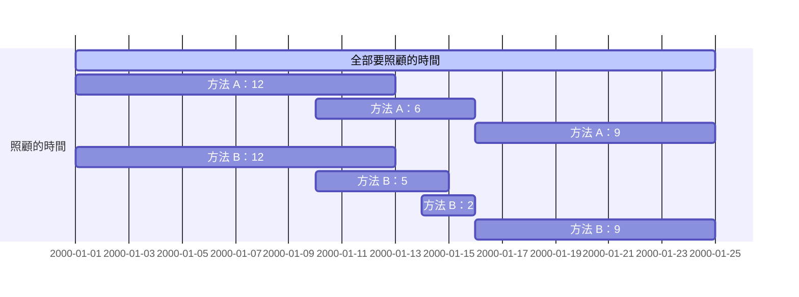

# **C++ 筆記**  
## [TOJ](https://toj.tfcis.org/oj/) 題解  

### [3 / GCD](https://toj.tfcis.org/oj/pro/3/)  

<details>

<summary>題目</summary>

### 題目敘述  
求兩數之最大公因數(GCD) 
    
### 輸入說明  
第一個整數 $T$ ，代表測資數  
接下來有 $T$ 行，每行有兩個整數 $a,b$  
    
### 輸出說明  
輸出每個 $a,b$ 的最大公因數  
    
### 輸入限制  
$1 \leq T \leq 1000$  
$0 \leq a,b \leq 2,147,483,647$  
    
### 範例輸入
```
4
10 2
3 1
5 7
20 12
```

### 範例輸出
```
2
1
1
4
```

</details>

<details>

<summary>題解</summary>

首先先按照國中所教的  
最大公因數就是， 能够整除 $a,b$ 的最大正整數  
因此可以從 $a,b$ 內較小的數開始遞減  
直到找到能够整除 $a,b$ 的最大正整數為止  
```cpp
#include<bits/stdc++.h>
using namespace std;

int main() {
    int n,a,b;
    cin>>n;
    while(n--){
        cin>>a>>b;
        for(int i=min(a,b); i>0; i--){
            if(a%i==0 && b%i==0){
                cout<<i<<endl;
                break;
            }
        }
    }
}
```
然後就 TLE 了，只好來優化算法  

國中教的最大公因數求法出了短除法外，還有
**輾轉相除法**  

稍稍修改一下成為**輾轉相除法**的程式碼  
```cpp
#include<bits/stdc++.h>
using namespace std;

int main(){
    int n,a,b,temp;
    cin>>n;
    while(n--){
        cin>>a>>b;
        while(b!=0){
            temp=b;
            b=a%b;
            a=temp;
        }
        cout<<a<<'\n';
    }
}
```
好了 AC 了  

</details>

<details>

<summary>AC code</summary>

```cpp
#include<bits/stdc++.h>
using namespace std;

int main(){
    int n,a,b,temp;
    cin>>n;
    while(n--){
        cin>>a>>b;
        cout<<__gcd(a,b)<<'\n';
    }
}
```

</details>

### [5 / Hello World!](https://toj.tfcis.org/oj/pro/5/)  
<details>

<summary>題目</summary>

### 題目敘述  
跟別人打招呼是一件有禮貌的事。來向大家打招呼吧！  
    
### 輸入說明  
輸入只有一行，為一個英文名字  
    
### 輸出說明  
向他打個招呼吧！名子加上 "Hello ,[name] !"(不含引號) 後輸出。  
    
### 輸入限制  
包含大小寫字母及空白，長度不超過20個字  
    
### 範例輸入
```
Peter
```

### 範例輸出
```
Hello ,Peter !
```

</details>
    
<details>

<summary>題解</summary>

第一眼，簡單的輸入輸出
```cpp
#include<bits/stdc++.h>
using namespace std;

int main() {
    string a;
    cin>>a;
    cout<<"Hello ,"<<a<<" !"<<endl;
}

```
然後就 WA 了，再看一眼題目  

### 輸入限制  
包含大小寫字母及 **空白** ，長度不超過20個字  

```cpp
#include<bits/stdc++.h>
using namespace std;

int main() {
    string a;
    getline(cin,a);
    cout<<"Hello ,"<<a<<" !"<<endl;
}
```
AC  

</details>
    
<details>

<summary>AC code</summary>

```cpp
#include<bits/stdc++.h>
using namespace std;

int main() {
    string a;
    getline(cin,a);
    cout<<"Hello ,"<<a<<" !"<<endl;
}
```

</details>

### [7 / 加加加加加速度](https://toj.tfcis.org/oj/pro/7/)  
<details>

<summary>題目</summary>

### 題目敘述  
國中物理曾學過，速度 $V$ 和時間 $T$ 的 $V-T$ 圖裡的面積就是位移  
而加速度 $A$ 和時間 $T$ 的 $A-T$ 圖的面積又代表速度變化量  
反過來看，如果是等加速度，那麼等加速度的值就相當於速度變化的斜率  

日前看到直觀數學老師騎著吃汽油的腳踏車呼嘯而過  
雖然速度一直在增加(向前為正向)，但變化之詭異至極，甚至會倒退(?)  
出於好奇拿出偷來的測速器把每秒的速度記錄下來  
你知道數學老師的微積分很強  
會在心算微積分後以一種特殊的「加加加...加速度」行進  
在這裡所謂”加加速度”就是指 ： 「加速度的增加量/秒」  
依此類推「加加加...( $N$ 個加)速度」就表示 ： 「加加加...( $N-1$ 個加)速度的增加量 / 秒」  
並且最高不超過 $2147483647 km/h$  (不要小看老師，超過光速不算什麼！)  

由於老師飆的太快所以只能記錄到N秒 (包含 $0$ 秒所以有 $N+1$ 個值)  
你知道有N+1個值就能算出 加加加...( $N$ 個加)速度 (假設他就是這樣加速的)  
從有限的資訊裡算出老師在時間內的的 加加加...加速度值吧!  

### 輸入說明  
第一行有一個整數 $K$ ，代表接下來有 $K$ 筆輸入，每筆輸入都有 $2$ 行  
每筆輸入的第一行的整數 $N$ 表示你有多少個值  
每筆輸入的第二行有 $N+1$ 個整數，代表記錄的速度(間格為秒)  
    
### 輸出說明  
輸出加加加....加速度 $Z$    
    
### 輸入限制  
$0 \leq N \leq 23$   
    
### 範例輸入
```
3
3
9 13 23 39
2
7 8 9
1
123 456
```

### 範例輸出
```
0
0
333
```

</details>
    
<details>

<summary>題解</summary>

題目要求 $N+1$ 個數的差  
的差  
的差  
... 
的差（共 $N$ 個）  

所以可以使用陣列來實作  
用回圈的方式計算數的差  
然後每次都少算一個數  
最後就可以得到  
$N+1$ 個數的差  
的差  
的差  
... 
的差（共 $N$ 個）了  
```cpp
#include<bits/stdc++.h>
using namespace std;

int main(){
	int k;
	cin>>k;
	while(k--){
		int n;
		cin>>n;
		n=n+1;
		long long int v[25];
		for(int i=0; i<n; i++){
			cin>>v[i];
		}
		for(int i=n; i>0; i--){
			for(int j=0; j<i-1; j++){
				v[j]=v[j+1]-v[j];
			}	
		}
		cout<<v[0]<<endl;
	}
}
```
然後就 AC 了  

</details>
    
<details>

<summary>AC code</summary>

```cpp
#include<bits/stdc++.h>
using namespace std;

int main() {
	int k;
	cin>>k;
	while(k--){
		int n;
		cin>>n;
		n=n+1;
		long long int v[25];
		for(int i=0; i<n; i++){
			cin>>v[i];
		}
		for(int i=n; i>0; i--){
			for(int j=0; j<i-1; j++){
				v[j]=v[j+1]-v[j];
			}	
		}
		cout<<v[0]<<endl;
	}
}
```

</details>

### [8 / Scytale](https://toj.tfcis.org/oj/pro/8/)  

<details>

<summary>題目</summary>

### 題目敘述  
密碼棒(Scytale, SKY-TAH-LEE, 希臘文 σκυτάλη - 棒子之意)是一種相當早期的訊息加密系統  

假設原始訊息如下  
`HELP ME I AM UNDER ATTACK`  

首先，發訊者會將一細長紙條纏繞在一個木棒上，並且在木棒上以正常方法寫上訊息  
`HELPMEIAMUNDERATTACK`  

```
|   |   |   |   |   |
| H | E | L | P | M |
| E | I | A | M | U |
| N | D | E | R | A |
| T | T | A | C | K |
|   |   |   |   |   |
```  

然後把紙條解開之後，訊息就不可辨識了！  
`H E N T E I D T L A E A P M R C M U A K` 

使者會把紙條傳遞到收件人手上。收件人會有一個事先打造好，和發訊者格式一樣的木棒。把紙條纏繞上去，便可以讀出原本的訊息  
`HELPMEIAMUNDERATTACK`  

它因為簡便而可靠，成為古戰場上常見的傳訊工具。但是，也由於它的簡單，破解攔截到的訊息並不是非常困難  
這裡假設加密解密所用的密碼棒都是均勻的多角柱體，且一個側面剛好可以容納一行字母  

於是，如果密碼棒是 $N$ 角柱，上面繞一圈就會剛好有 $N$ 個字符  

### 輸入說明  
多筆測資  
每筆測試資料一開始會是一個整數 $N$ ，代表解碼所用的密碼棒一圈有 $N$ 個字符  

接下來會有一個字串 $S$ ，是需要解碼的訊息  

### 輸出說明  
輸出把字條正確地繞到密碼棒上之後，讀出的訊息  

### 輸入限制  
$2 \leq N \leq 256$  
$S$ 的長度不超過 $1024$ 個字元  
    
### 範例輸入
```
4
HENTEIDTLAEAPMRCMUAK
```

### 範例輸出
```
HELPMEIAMUNDERATTACK
```
    
### 註  
訊號長度不一定會是纏繞圈數的整數倍  
不足處會補上空白字元如圖，解碼後輸出在對應位置  
```
|   |   |   |   |
| T | O | B | E |
| O | R | N | O |
| T | T | O | B |
| E |[ ]|[ ]|[ ]|
|   |   |   |   |
```  

密文： `[TOTEORT BNO EOB ]`  
訊息： `[TOBEORNOTTOBE   ]`  

</details>
    
<details>

<summary>題解</summary>

很明顯，這題要做的應該就是陣列模擬了  
只需要注意題目做後說的**不足處會補上空白字元**基本上就沒問題了  

```cpp
#include<bits/stdc++.h>
using namespace std;

int main(){
	int n;
	string a;
    while(cin>>n){
    	int j=1;
		getline(cin,a);
 	    getline(cin,a);
   		for(int i=0; i<a.size(); i++){
   	 	    if(j>a.size()){
   	 		    j=j-a.size()+1;
			}
			cout<<a[j-1];
			j+=n;
		}
		cout<<endl;
	}
}
```  

</details>
    
<details>

<summary>AC code</summary>

```cpp
#include<bits/stdc++.h>
using namespace std;

int main(){
	int n;
	string a;
    while(cin>>n){
    	int j=1;
		getline(cin,a);
 	    getline(cin,a);
   		for(int i=0; i<a.size(); i++){
   	 	    if(j>a.size()){
   	 		    j=j-a.size()+1;
			}
			cout<<a[j-1];
			j+=n;
		}
		cout<<endl;
	}
}
```  

</details>

### [13 / 背包](https://toj.tfcis.org/oj/pro/13/)  
<details>

<summary>題目</summary>

### 題目敘述  
有一個容量為 $V$ 的背包  
有 $n$ 種物品體積和價值分別為 $w,p$ ，每種物品數量無限  
最好的取法下總價值為多少  
    
### 輸入說明  
有多組測資  
每組測資第一行為背包容量 $V$  
第二行第一個整數 $n$ ，代表物品種類個數  
第三行有n組 $w_i,p_i$ ，代表每件物品的體積、價值  
    
### 輸出說明  
針對每組測資輸出最大價值，每行一個數字  

### 輸入限制  
$測資數 \leq 200$  
$1 \leq V \leq 100000$  
$1 \leq n \leq 100$  
$1 \leq w_i \leq V$  
$1 \leq p_i \leq 100000$  
    
### 範例輸入
```
5
2
3 3 2 7
```

### 範例輸出
```
14
```

</details>
    
<details>

<summary>題解</summary>

經典的**無限背包**問題  

設定 $dp[i][j]$ 代表在 只看前 $i$ 個物品，重量在 $j$ 時的最大價值  

這樣基底就是：  
* $dp[i][j]=0$  

而轉移式的話就會是：  
如果 $j-w_i \geq 0$  
* $dp[i][j]= max(dp[i-1][j],dp[i][j-w[i]]+p[i])$

否則  
* $dp[i][j]= max(dp[i-1][j],dp[i][j-1])$  

</details>
    
<details>

<summary>AC code</summary>

```cpp
#include<bits/stdc++.h>
using namespace std;

long long int dp[105][100005];

int main() {
    int all,n;
    while(cin>>all>>n){
        long long int w[n+1],p[n+1];
        for(int i=1; i<n+1; i++){
            cin>>w[i]>>p[i];
        }
        long long int ans=0;
        for(int i=1; i<n+1; i++){
            for(int j=1; j<all+1; j++){
            	dp[i][j] = dp[i-1][j];
            	if(j-w[i]>=0){
            		dp[i][j]=max(dp[i][j],dp[i][j-w[i]]+p[i]);
				}
            	dp[i][j]=max(dp[i][j-1],dp[i][j]);
            	ans=max(dp[i][j],ans);
            }
        }
        cout<<ans<<"\n";    
    }
}
```

</details>

### [17 / B.塔的力量](https://toj.tfcis.org/oj/pro/17/)  

<details>

<summary>題目</summary>

### 題目敘述  
我們的好學生─Mike 和 Frame 被國文老師找來幫她提手提袋，就在他們放下手提袋的那一刻，地面好似突然開了洞，他們雙雙落入了永無止境的黑暗中  
但身為一個用功的一中青年，毋忘利用這機會計算 $ΔS=\frac{1}{2}gt^2$ 看看自己落下了多少距離。片刻，彷彿永遠，就他們認為自己注定永久困在這片虛空之中，有股聲音從那最深遠的地方傳來  

「I found you finally……」  

「思必克菜你死,OK?」英文能力嚴重低落的 Frame 回應道。即使他們看不見彼此，但 Mike 的嘆氣聲清晰的傳到 Frame 的耳裡，顯然那聲音聽見了  
「勇者們，你們的好心開啟了通往貓咪世界道路的門，要通過這片黑暗，你必須知道們彼此你心靈之眼的樣子。」  
「天下哪有這麼唬爛的事情？」Mike 以一種極其為不滿的語氣說道  
「你們的心靈之眼與你們的心情指數有關，」那聲音句點了 Mike，「用一些符號組成的菱形……」隨著這聲音逐漸消散，一個神祕的圖騰出現在他們面前  
「我今天的心情指數是 3，跟這個有什麼關聯？」Frame 說道，Mike 依舊不屑中  
「如果你們沒辦法知道對方心靈之眼的長相，就會永遠被囚禁在這片黑暗中。」那聲音再次說道  
因為他們剛剛一起幫國文老師提手提袋，所以他們知道對方的心情指數。那你能幫他們找出對方心靈之眼的樣子嗎？  
    
### 輸入說明  
有多筆測資，每筆測資包含一個數字 $P$ ，為對方的心情指數  
    
### 輸出說明  
對於每個心情指數，輸出其心靈之眼的樣子    
    
### 輸入限制  
$1 \leq P \leq 26$  
    
### 範例輸入
```
3
2
```

### 範例輸出
```
  A
 ABA
ABCBA
 ABA
  A
 A
ABA
 A
```

</details>

<details>

<summary>題解</summary>

星星數變種版本  
可以看作是一個正的三角形和一個反的三角形  
先不管裡面的文字  
```cpp
#include<bits/stdc++.h>
using namespace std;

int main() {
    int n;
    while(cin>>n){
        for(int i=1; i<=n; i++){
            for(int j=1; j<=n-i; j++){
                cout<<" ";
            }
            for(int j=1; j<=i; j++){
                cout<<j;
            }
            for(int j=i-1; j>=1; j--){
                cout<<j;
            }
            cout<<endl;
        }
        for(int i=n-1; i>=1; i--){
            for(int j=1; j<=n-i; j++){
                cout<<" ";
            }
            for(int j=1; j<=i; j++){
                cout<<j;
            }
            for(int j=i-1; j>=1; j--){
                cout<<j;
            }
            cout<<endl;
        }
    }
}
``` 
```
  1
 121
12321
 121
  1
 1
121
 1
```
接下來只要把 `1,2,3` 改成 `A,B,C` 就可以了  
利用 ASCII 的計算就可以實現了  

</details>

<details>

<summary>AC code</summary>

```cpp
#include<bits/stdc++.h>
using namespace std;

int main() {
    int n;
    while(cin>>n){
        for(int i=1; i<=n; i++){
            for(int j=1; j<=n-i; j++){
                cout<<" ";
            }
            for(int j=1; j<=i; j++){
                cout<<char('A'+j-1);
            }
            for(int j=i-1; j>=1; j--){
                cout<<char('A'+j-1);
            }
            cout<<endl;
        }
        for(int i=n-1; i>=1; i--){
            for(int j=1; j<=n-i; j++){
                cout<<" ";
            }
            for(int j=1; j<=i; j++){
                cout<<char('A'+j-1);
            }
            for(int j=i-1; j>=1; j--){
                cout<<char('A'+j-1);
            }
            cout<<endl;
        }
    }
}
```

</details>

### [18 / C.咒文](https://toj.tfcis.org/oj/pro/18/)  

<details>

<summary>題目</summary>

### 題目敘述  
當 Frame 想出了 Mike 心靈之眼時，突然一陣強光襲面而來，剎那間，他們已經站在一片廣大的草原上，一座被迷宮包圍的巨塔聳立於遠方  
「這是哪裡啊？」Frame 驚訝的問，Mike 雖然一副不屑的樣子，但眼神洩露了他的恐慌  
「歡迎來到貓咪王國，勇者們！感謝你們前來幫助我們。」一隻繫著圍巾的貓從前方的草叢冒出來  

「這和我們有什麼關聯？」Mike 問道，Frame 則是蹲下來望著她  
「我叫 Snow，在這裡一直等著你們。在不久之前，有一隻很邪惡的貓，叫 Felix，入侵這這片和平的國度，他利用他強大的法力，奴役了許多貓兒替他做事，近來他更有意要攻陷你們的世界，但你們今日的善心，使你們被這一個世界的力量召喚，成為拯救世界的勇者。」  

「但我們什麼都不會啊。」Frame 說道  
而那隻貓則是從另一旁的草叢抽出了一本咒文書，小心翼翼地翻開，Mike 也好奇的湊了過來  
「這裡有你們可以使用的魔法，即使什麼也不會，只要能朗誦出咒文即可。但要能對 Felix 產生效力，必須使用這些『強效咒文』，比如說這句『Ama da,Dama』咒文  
字母由前往後，由後往前看都是一樣的，如此的咒文能使力量自我加成，增強 $1000000$ 倍的效力！」  
Frame 和 Mike 接過了這本書，仔細研究，但他們看到密密麻麻的符號頭都昏了  
幸好他們身上有電子掃描裝置，能把這片咒文轉成電子檔，接下來再寫個程式把強效咒文標記起來就行了，恰好進入貓咪世界時，老師的筆電也一並掉了下來…  
    
### 輸入說明  
有多句咒文，每句咒文佔一行  
    
### 輸出說明  
如果這句咒文是強效咒文，請在咒文前加上 `SETUP!` 後輸出，否則輸出原咒文即可  
    
### 輸入限制  
咒文由英文大小寫、標點符號、空白所組成，每句咒文字數不超過 $200$ 字  
    
### 範例輸入
```
Ama da ,Dama
Holy rush!
```

### 範例輸出
```
SETUP! Ama da ,Dama
Holy rush!
```

</details>

<details>

<summary>題解</summary>

因為他只要檢查字母是否相同  
所以要先把所有大寫字母換成小寫字母  
也要無視所有非字母的字元  
```cpp
#include<bits/stdc++.h>
using namespace std;

int main() {
    string s;
    while(getline(cin,s)){
        string s2="";
        for(int i=0; i<s.size(); i++){
            if(s[i]>='a'&&s[i]<='z'){
                s2+=s[i];
            }
            else if(s[i]>='A'&&s[i]<='Z'){
                s2+=char(s[i]-'A'+'a');
            }
        }
    }
}
```

接下來就是從頭遍歷整個新的字串檢查他是不是回文就可以了  

</details>

<details>

<summary>AC code</summary>

```cpp
#include<bits/stdc++.h>
using namespace std;

int main() {
    string s;
    while(getline(cin,s)){
        string s2="";
        for(int i=0; i<s.size(); i++){
            if(s[i]>='a'&&s[i]<='z'){
                s2+=s[i];
            }
            else if(s[i]>='A'&&s[i]<='Z'){
                s2+=char(s[i]-'A'+'a');
            }
        }
        bool flg=1;
        for(int i=0;i<s2.size()/2;i++){
            if(s2[i]!=s2[s2.size()-i-1]){
                flg=0;
                break;
            }
        }
        if(flg==0){
            cout<<s<<endl;
        }
        else{
            cout<<"SETUP! "<<s<<endl;
        }
    }
}
```

</details>

### [19 / D.Portal](https://toj.tfcis.org/oj/pro/19/)  

<details>

<summary>題目</summary>

### 題目敘述  
「O! Gla Algo」一震爆裂聲傳過天際，閃電照亮了整個大地。「這就是強效咒文的威力！我感到了源源不絕的力量與自信，現在，我們已經可以去討伐 BOSS 了！」Frame 和 Mike 說著，而在一旁觀看的 Snow 則是用尾巴輕點，示意他們跟上前來  

「如果你們想要見到 Felix，你們就得分別站到位於草原兩側的祭壇上，使用空間咒文扭曲空間，在你們法力的交界處會產生異次元的入口，屆時，只又我擲入這，」Snow 拿出了像法杖的木棍「就能建立一座穩固的異次元傳送門了！」於是他們立刻衝向祭壇，施展空間咒文。已知空間咒文能扭曲以自身為圓心，半徑為 $R$ 的空間場，因為 Frame 及 Mike 的能力有所差異，因此他們施展出來的空間魔法半徑有所不同，那他們是否能建立異次元傳送門？如果僅邊有交集仍是可以建立傳送門的。  
    
### 輸入說明  
有多筆測資  
每筆測資包含 $6$ 個浮點數， $X_1,Y_1,R_1,X_2,Y_2,R_2$ ，分別代表 Mike的座標及咒文效力半徑 $(X_1,Y_1,R_1)$ 及 Frame $(X_2,Y_2,R_2)$ 的座標及咒文效力半徑  
    
### 輸出說明  
如果他們可以建立異次元傳送門，請輸出 `Quick in`，否則輸出 `Nearly`  
    
### 輸入限制  
$0 \leq X_1,Y_1,R_1,X_2,Y_2,R_2 \leq 10^9$  
    
### 範例輸入
```
0 0 5 10 0 8
0 0 5 10 10 5
```

### 範例輸出
```
Quick in
Nearly
```

</details>

<details>

<summary>題解</summary>

單純的考輸入輸出還有 if else 而已  
唯一要注意的是浮點數 double  

```cpp
#include<bits/stdc++.h>
using namespace std;

int main() {
    double x1,y1,r1,x2,y2,r2;
    while(cin>>x1>>y1>>r1>>x2>>y2>>r2){
    	if(sqrt(pow(x1-x2,2)+pow(y1-y2,2))<=r1+r2){
    		cout<<"Quick in"<<endl;
		}
		else{
			cout<<"Nearly"<<endl;
		}
	}
}
```

好了 AC 了  

</details>

<details>

<summary>AC code</summary>

```cpp
#include<bits/stdc++.h>
using namespace std;

int main() {
    double x1,y1,r1,x2,y2,r2;
    while(cin>>x1>>y1>>r1>>x2>>y2>>r2){
    	if(sqrt(pow(x1-x2,2)+pow(y1-y2,2))<=r1+r2){
    		cout<<"Quick in"<<endl;
		}
		else{
			cout<<"Nearly"<<endl;
		}
	}
}
```

</details>

### [22 / babysitter](https://toj.tfcis.org/oj/pro/22/)  

<details>

<summary>題目</summary>

### 題目敘述  
有多個保母應徵工作，每個保母有自己可以工作的時間  
每個保母可以從時間 $X$ 工作到時間 $Y$  
問最少要請幾個保母才可以任何時間寶寶都有人照顧  
    
### 輸入說明  
每筆測資的第一行有一個整數 $N$ ，代表保母個數  
接下來 $N$ 行，每一行有兩個數字 $X,Y$ ，代表這位保母可以從 $X$ 工作到 $Y$  
    
### 輸出說明  
如果任何時間可以都有保母照顧，輸出最少需要幾位保母  
如果不行，輸出 `NO`  
    
### 輸入限制  
$1 \leq N \leq 1000$  
$1 \leq X,Y \leq 100000$  
    
### 範例輸入1
```
6
1 50
2 90
45 150
50 140
151 200
145 190
```

### 範例輸出1
```
3
```

### 範例輸入2
```
3
1 50
60 70
70 100
```

### 範例輸出1
```
NO
```

</details>

<details>

<summary>題解</summary>

一題非常經典的 greedy  

思路：  
時間 $i$ 一定有人需要來顧，所以我們先找顧的到 $i$ 的最好的那個  
接下來呢？  

找做最晚的呢？似乎就可以了... 嗎？  

定義 $A$ 是我們剛剛方法做出來的方案， $B$ 是任何其他的方案  



在第一個 $A$ 跟 $B$ 不一樣的地方來看，我們一定會發現 $A$ 比 $B$ 不來的差  

</details>

<details>

<summary>AC code</summary>

```cpp
#include <bits/stdc++.h>
using namespace std;

bool cmp(pair<int,int> a,pair<int,int> b){
    if(a.first==b.first){
        return a.second>b.second;
    }
    else{
        return a.first<b.first;
    }
}

bool cmp2(pair<int,int> a,pair<int,int> b){
    if(a.second==b.second){
        return a.first<b.first;
    }
    return a.second>b.second;
}

int main(){
    int start=100000,finish=1;
    int n;
    while(cin>>n){
        pair<int,int> p[n+1];
        int a,b;
        for(int i=0;i<n;i++){
            cin>>a>>b;
            p[i].first=min(a,b);
            p[i].second=max(a,b);
            start=min(start,p[i].first);
            finish=max(finish,p[i].second);
        }
        sort(p,p+n,cmp);
        int mx=p[0].second;
        int ans=1;
        int cnt;
        while(mx<finish){
            cnt=0;
            while(p[cnt].first<=mx+1){
                cnt++;
            }
            sort(p,p+cnt,cmp2);
            if(mx==p[0].second){
                cout<<"NO"<<endl;
                return 0;
            }
            mx=p[0].second;
            ans++;
        }
        cout<<ans<<endl;
    }
}
```

</details>

### [26 / 最長回文](https://toj.tfcis.org/oj/pro/26/)  

<details>

<summary>題目</summary>

### 題目敘述  
最長回文子字串  
例如:  
abcba --> abcba  
aabcdbaa --> aabbaa  
abda --> aba or ada  
    
### 輸入說明  
第一行為一整數 $T$ ，代表測資數目  
接下來 $T$ 行各有一字串  

    
### 輸出說明  
輸出各自串的最長回文子字串之長度，一行一個數字  
    
### 輸入限制  
$1 \leq T \leq 100$  
$字串長度 \leq 3000$  
字串皆為英文小寫
    
### 範例輸入
```
3
abcba
acabdaa
abda
```

### 範例輸出
```
5
5
3
```

</details>

<details>

<summary>題解</summary>

正常來說是一題 **最長回文子串** 的題目  
> #### 最長回文子串  
> 在一個字串中尋找一個最長的 **連續** 的回文的子串  

但這邊的並沒有要求 **連續**  
所以可以看作是 自己 跟 自己的反轉 的 LCS  
知道是 LCS 之後實作就很簡單了  

</details>

<details>

<summary>AC code</summary>

```cpp
#include <bits/stdc++.h>
using namespace std;

int lcs[3005][3005];

int main(){
    int n;
    cin>>n;
    string s;
    while(n--){
        cin>>s;
        for(int i=1;i<=s.size();i++){
        	for(int j=1;j<=s.size();j++){
        		lcs[i][j]=0;
        		if(s[i-1]==s[s.size()-j]){
        			lcs[i][j]=lcs[i-1][j-1]+1;
				}
				else{
					lcs[i][j]=max(lcs[i-1][j],lcs[i][j-1]);
				}
			}
		}
		cout<<lcs[s.size()][s.size()]<<endl;
    }
}
```

</details>

### [36 / simple problem](https://toj.tfcis.org/oj/pro/26/)  

<details>

<summary>題目</summary>

### 題目敘述  
這是一個很簡單的題目，題目敘述結束  
    
### 輸入說明  
輸入只有 $3$ 個整數 $A, B, C$  

    
### 輸出說明  
輸出 $A^B mod C$  
    
### 輸入限制  
$0 \leq A \leq 2^{31}-1$  
$0 \leq B \leq 2^{63}-1$  
$1 \leq C \leq 9439$  
    
### 範例輸入
```
10 3 7
```

### 範例輸出
```
6
```

</details>

<details>

<summary>題解</summary>

快速冪！！！  
可以在做次方乘法的時候，可以讓複雜度從 $O(N) \rightarrow O(logN)$  

例如，在計算 $2^{39}$ 時  
可以先將它拆成 $2^{32} \times 2^{4} \times 2^{2} \times 2^{1}$  
這樣只需要做 $6+3$ 次計算就可以得到答案，而不是 $39$ 次  

為什麼是 $6+3$  
因為要算出 $2^{32}$ 次需要算出 $2^{1}, 2^{2}, 2^{4}, 2^{8}, 2^{16}, 2^{32}$ 六次  
而算出 $2^{39}$ 又需要 $2^{32} \times 2^{4} \times 2^{2} \times 2^{1}$ 三次  

所以一共需要計算 $9$ 次

因此，只要用一個迴圈遍歷 $B$ 在二進位下的每個位數  
就可以輕鬆的實作出快速冪了  

</details>

<details>

<summary>AC code</summary>

```cpp
#include <bits/stdc++.h>
using namespace std;

int lcs[3005][3005];

int main(){
    long long int a,b,c;
	int total=1,r,count;
	cin>>a>>b>>c;
	r=a%c;
	for(int i=1;i<=b;i++){
		total*=r;
		total%=c;		
		if(total==1){
			count=i;
			b%=count;
			for(int i=1;i<=b;i++){
				total*=r;
				total%=c;
			}
			break;
		}
	}	
	cout<<total<<"\n";
}
```

</details>


