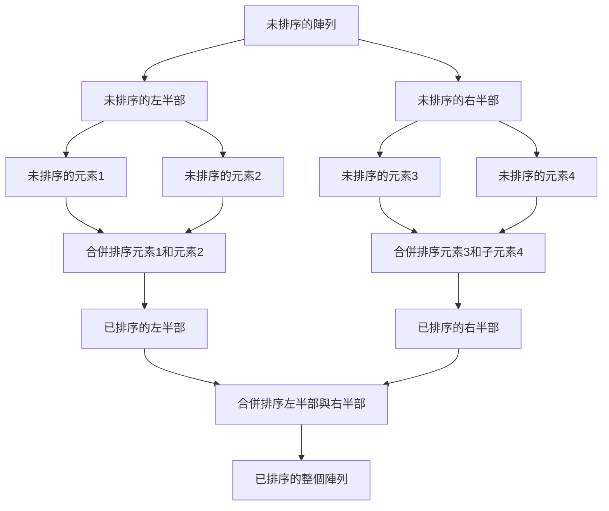
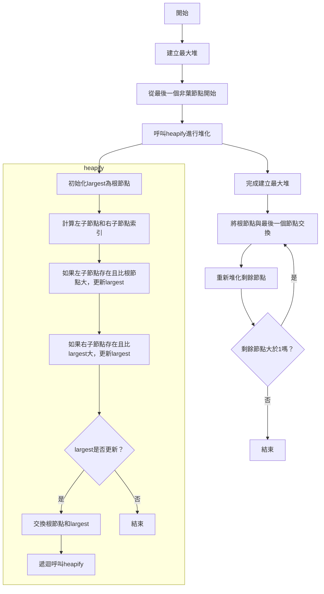
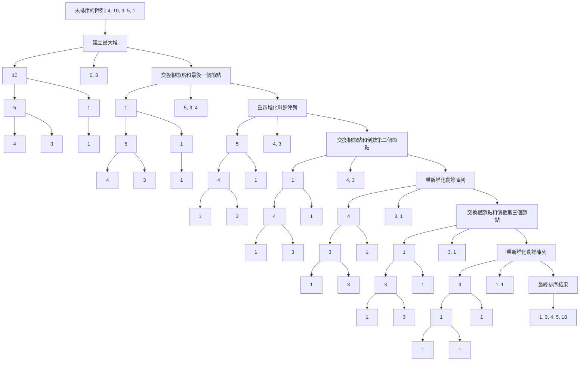

# **C++ 筆記**  
## 排序 Sort  

常見的排序演算法有：  

* 泡泡排序 Bubble Sort  
* 選擇排序 Selection Sort  
* 插入排序 Insertion Sort  
* 快速排序 Quick Sort  
* 合併排序 Merge Sort  
* 堆積排序 Heap Sort
* e.x. Bogo Sort

等等  

---

## 1. 泡泡排序 Bubble Sort  

### 時間複雜度： $O(N^2)$  

### 想法：  

如果這個數字比右邊的大，交換兩位置，使較大的逐漸浮到右側，再縮小範圍進行下一回合  

### 圖示：  


### 說明：  

使用雙層迴圈，**外層迴圈** 控制回合數，**內層迴圈** 控制每一回合的比較次數  

**外層迴圈** 只需比較到倒數第二個數字( $n-1$ )就可以停止，因為 a[j+1] 會比較到最後一個數字  
**內層迴圈** $(n-1-i)$ 代表比較範圍會隨著已經排序好的數量增加而減少  

```cpp
for(int i=0; i<n-1; i++){
    for(int j=0; j<(n-1-i); j++){
        if(a[j]>a[j+1]){
            swap(a[j],a[j+1]);
        }
    }
}
```

---

## 2. 選擇排序 Selection Sort  

### 時間複雜度： $O(N^2)$  

### 想法：  

在未排序區中找最小值，放置在已排序區的末尾  

### 圖示：  


### 說明：  

使用雙層迴圈，**外層迴圈** 控制回合數，**內層迴圈** 控制每一回合的比較次數  

**外層迴圈** 比較到最後一個數字( $n$ )才停止，因為要檢查整個陣列  
**內層迴圈** 從 $(i+1)$ 開始代表比較範圍會隨著已經排序好的數量增加而減少，而 $i$ 以前的範圍則是已排序區  

```cpp
for(int i=0; i<n; i++){
    int min = i;
    for(int j=i+1; j<n; j++){
        if(a[j]<a[min]){
            min=j;
        }
    }
    swap(a[i],a[min]);
}
```

---

## 3. 插入排序 Insertion Sort  

### 時間複雜度： $O(N^2)$  

### 想法：  

一開始時已排序區只有一個數字，從尾端往回比較大小，將未排序區的數字插入到已排序區的適當位置  

### 圖示：  


### 說明：  

使用雙層迴圈，**外層迴圈** 控制回合數，**內層迴圈** 控制每一回合的比較次數  

**外層迴圈** 比較到最後一個數字( $n$ )才停止，因為要遍歷整個陣列  
**內層迴圈** 從 $j$ （已排序區的末端）開始，一路反著搜索直到適當的位子，因此搜索範圍會從一開始的 $0$ ，逐漸增大到整個陣列的大小 $n$  

```cpp
for(i=1; i<n; i++){
    insert=arr[i];
    j=i-1;
    while(j>=0&&arr[j]>insert){
        arr[j+1]=arr[j];
        j--;
    }
    arr[j+1]=insert;
}
```

---

## 4. 快速排序 Quick Sort  

### 時間複雜度：

平均情況： $O(n log n)$  
最壞情況： $O(n²)$ （當每次選取的基準點是最大或最小元素時）  
最好情況： $O(n log n)$ （當每次選取的基準點將數組均勻分割時）  

### 想法：  

選擇數組中的一個元素作為基準點。選擇的方法可以是第一個元素、最後一個元素、中間元素或者隨機選擇一個元素  

將數組分為兩部分，使得基準點左側的元素都小於或等於基準點，右側的元素都大於基準點。這一步確保基準點在數組中的正確位置  

對基準點左側和右側的子數組分別進行快速排序，因此，兩個子數組都會再次經歷選擇基準點和分區的過程  

當子數組的大小為0或1時，遞歸結束  

### 圖示：  


### 說明：  

使用遞迴，不斷將排序範圍縮小  

選擇數組的最後一個元素作為基準點後，循環遍歷數組，將小於或等於基準點的元素移到左邊，且將基準點放置在正確位置  

重複上述步驟，對基準點左側和右側的子數組進行排序，直到子陣列大小為 $1$ ，當所有子陣列都完成排序，即停止遞迴  

```cpp
void quickSort(int arr[], int low, int high) {
    if(low<high){
        int pivot=arr[high];
        int i=(low-1);
        for(int j=low; j<=high-1; j++){
            if(arr[j]<=pivot){
                i++;
                swap(arr[i],arr[j]);
            }
        }
        swap(arr[i+1],arr[high]);
        int pi=i+1;
        
        quickSort(arr, low, pi-1);
        quickSort(arr, pi+1, high);
    }
}

```

---

## 5. 合併排序 Merge Sort  

### 時間複雜度： $O(n log n)$  

### 想法：  

一種基於分治法的排序演算法  

將一個未排序的陣列分成若干個子陣列，直到每個子陣列只有一個元素，然後再逐步將這些子陣列合併成排序好的陣列  



### 圖示：  

  

### 說明：  

將未排序的陣列從中間分成兩個子陣列後，將這兩個子陣列再分別從中間分成更小的子陣列，重複直到每個子陣列只有一個元素為止  

將相鄰的兩個子陣列進行合併，並使合併後的子陣列內部元素有序  

重複此步驟，直到所有子陣列合併成一個完整的排序好的陣列  

```cpp
void mergeSort(vector<int>& arr, int left, int right){
    if(left>=right){
        return;
    }

    int mid=left+(right-left)/2;

    mergeSort(arr, left, mid);
    mergeSort(arr, mid + 1, right);

    int n1=mid-left+1;
    int n2=right-mid;

    vector<int> leftArr(n1), rightArr(n2);

    for(int i=0; i<n1;i++){
        leftArr[i]=arr[left+i];
    }
    for(int j=0; j<n2; j++){
        rightArr[j]=arr[mid+1+j];
    }

    int i=0;
    int j=0;
    int k=left;

    while(i<n1&&j<n2){
        if(leftArr[i]<=rightArr[j]){
            arr[k]=leftArr[i];
            i++;
        }
        else{
            arr[k]=rightArr[j];
            j++;
        }
        k++;
    }

    while(i<n1){
        arr[k]=leftArr[i];
        i++;
        k++;
    }

    while(j<n2){
        arr[k]=rightArr[j];
        j++;
        k++;
    }
}

```

---

## 6. 堆積排序 Heap Sort  

### 時間複雜度： $O(n log n)$  

### 想法：  

Heap Sort是一種基於比較的排序演算法。它利用堆積資料結構（Heap）來幫助實現排序  

首先將資料構建成一棵完全二元樹，且每個節點的值都大於或等於其子節點的值  

拔除最大值後，重新生成一棵完全二元樹，重複此步驟直到所有資料完成排序  



### 圖示：  



### 說明：  

使用迴圈從最後一個非葉子節點開始建成max heap  

將max heap的根（最大值）與堆的最後一個元素交換  

將剩餘的元素重新構建成max heap  

重複上述步驟，直到堆的大小縮小為1  

```cpp
void heapSort(vector<int>& arr){
    int n=arr.size();

    auto heapify=[&](int n, int i){
        int largest=i;
        int left=2*i+1;
        int right=2*i+2;

        if(left<n&&arr[left]>arr[largest]){
            largest=left;
        }

        if(right<n&&arr[right]>arr[largest]){
            largest=right;
        }

        if(largest!=i){
            swap(arr[i], arr[largest]);
            heapify(n, largest);
        }
    };

    for(int i=n/2-1; i>=0; i--){
        heapify(n, i);
    }

    for(int i=n-1; i>0; i--){
        swap(arr[0], arr[i]);
        heapify(i, 0);
    }
}
```

---

## E.X. Bogo Sort

### 時間複雜度： 
平均情況： $O(n \cdot n!)$  
最壞情況： $O(\infty)$

### 想法：  

一種靠陽壽的排序方式，每次將數據**隨機**排列後，檢查數據是否已經排序完成，若未排序完成則再次將數據**隨機**排列  

放這個排序方式只是因為他的想法十分有趣，在實際的應用上基本上沒有任何實際用途  

### 圖示：  


### 說明：  

`isSorted()` 函式用來檢查陣列是否已經排序  
`bogoSort()` 函式則不斷隨機排列陣列直到陣列排序完成  

```cpp
bool isSorted(const vector<int>& arr){
    for(size_t i=1; i<arr.size(); i++){
        if(arr[i]<arr[i-1]){
            return false;
        }
    }
    return true;
}

void bogoSort(vector<int>& arr){
    while(!isSorted(arr)){
        random_shuffle(arr.begin(), arr.end());
    }
}

```
