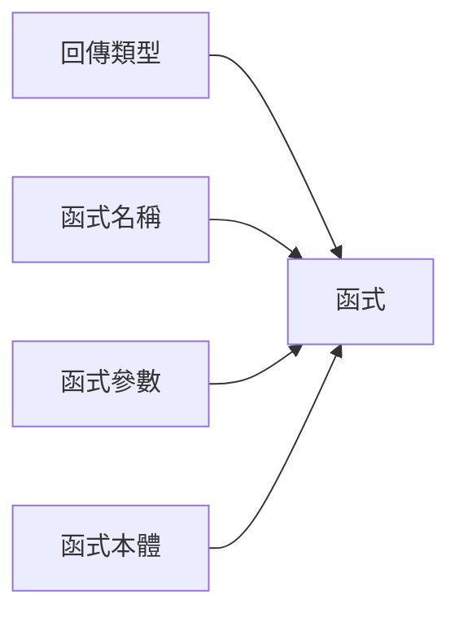
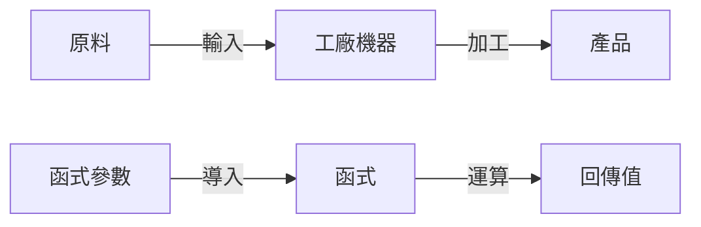
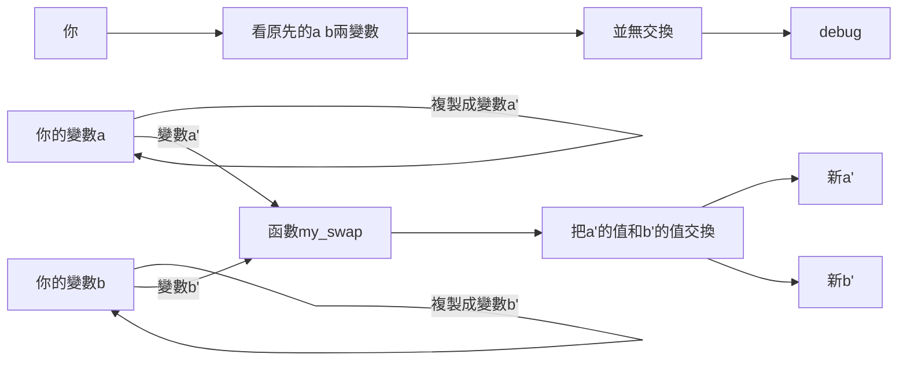
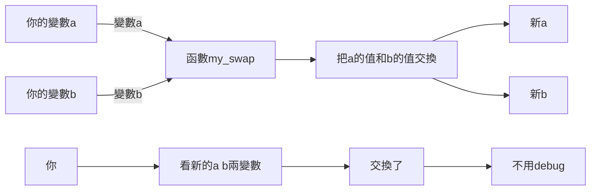

# **程式 筆記**  
## 函式 function  

當有些code經常重複時，有沒有什麼好方法可以讓這段code有效率被使用？  
這就是函式要做的事情  

函式的使用範圍很廣  
使用函式可以讓你的code變得精簡  
也變得容易debug  

## 基本架構 function  

```cpp
type name(args){
    //code
}
```

函式分成四個部份，`type` 回傳類型、`name` 函式名稱、`args` 函式參數、`//code` 函式本體  



1. `回傳類型` : 就類似變數類型  
2. `函式名稱` : 就類似變數名稱  
3. `函數參數` : 一個函式要運作所需要的東西  
4. `函數本體` : 就是我們平時寫 main 的地方  

而且每個函式都至少要有一個return用於結束函式  
除了回傳類型為void的函式  

---

### 函式 - 回傳類型  

身為一個函式，他需要知道自己的身份  

也就是跟變數一樣  

有整數、小數、字元、字串、布林 等等  

| 回傳類型 | 程式碼 |
|:--------:|:------:|
|   整數   |  int   |
|   小數   | double |
|   布林   |  bool  |
|   字元   |  char  |
|   字串   | string |
| 不需回傳 |  void  |

---

### 函式 - 函式名稱  

跟變數一樣，身為一個函式，他必須知道他的名字  

一樣要注意不要用到電腦內建的東西（關鍵字），例如：  

max , min , main , int 等等  

---

### 函式 - 函式參數  

一個函式要運作所需要的東西  

也就是跟你索要一些材料，然後加工成你要的樣子  



因此其實可以把 `函式` 看成一台 `工廠機器`  
把 `函式參數` 看成 `原料`  
把最後的 `回傳值` 看成 `產品`  

---

### 函式 - 函式本體

其實就是你的計算過程  

---

### 範例
```cpp
int get_five(){
    return 5;
}
```
回傳一個5的函式  

```cpp
int get_abs(int x){
    if(x>0){
        return x;
    } 
    return -x;
}
```
回傳x的絕對值的函式  

---

## 引用(Reference)

如果想寫交換兩個int的函數，有些人會這樣寫  

```cpp 
void my_swap(int a, int b){
    int tmp=a;
    a=b;
    b=temp;
}
```

但是執行這個函數你會發現他根本沒有成功  
為什麼呢？  
因為這個函式是把拿到的參數**複製**一份再交換的，當然不換交換到原本的  


那要怎麼拿到原本的變數呢  
很簡單，加上 `&` 就可以了  

```cpp
void my_swap(int& a, int& b){
    int tmp=a;
    a=b;
    b=tmp;
}
```


在使用引用時，有些要注意
* 引用必須要有初始值，不能像變數一樣沒有
* 引用的對象必須是變數

## 補充

有時候會用到 `a函式` 呼叫 `b函式` ， `b函式` 又呼叫 `a函式`  
這時候如果用一般的寫法  

```cpp
#include<bits/stdc++.h>
using namespace std;

int a(int x){
    return b(x+1);
}

int b(int x){
    return x*2;
}

int main(){
    cout << a(1) << endl;
}
```
他會說
```cpp
int a(int x){
    return b(x+1);
}
```
內的 `b(x+1)` 沒有被定義  

所以應該要改成  

```cpp
#include<bits/stdc++.h>
using namespace std;

int a(int x);
int b(int x);

int main(){
    cout << a(1) << endl;
}

int a(int x){
    return b(x+1);
}

int b(int x){
    return x*2;
}
```

先跟電腦說有兩個函示  

然後在最後才補上他們的功能  

這樣就可以正常執行了  

## 快樂的練習時間

[TOJ 170](https://toj.tfcis.org/oj/pro/170/)  
這邊的練習很少，因為 `如果能用函式解的題目，基本上用一般解法基本上也能過，如果一定要用函式解的題目，基本上要會遞迴才可以`  
