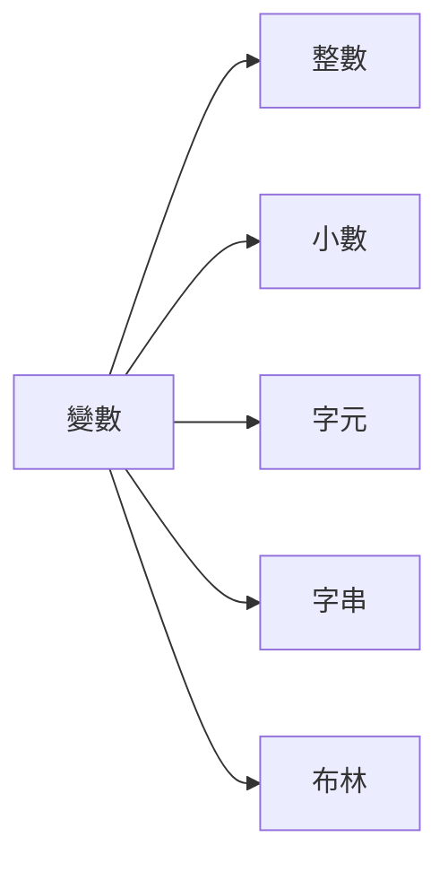

# **Pyhton 筆記**  
## 變數與資料型態 Variables and Types  

# 基本架構  

## 變數宣告  

一個變數，必須知道  
1. 身份  
2. 名字  
3. 值域  

## 身份  



### 整數：  
python 的整數最大值並不是熟悉的 $2^{31}-1$ ， $2147483647$  
而是 $2^{63}-1$ ， $9223372036854775807$  
而最小值則是 $-2^{63}$ ， $-9223372036854775808$  

## 名字  

* 第一個字母不為數字  
* 變數不得有空白  
* 變數名稱不得與保留字相同  
* 符號只能使用_  

## 值域  

* 除了 ```def():``` 內的東西為獨立外，都為共享  

## 特點  

* **不需要先宣告身份**  
