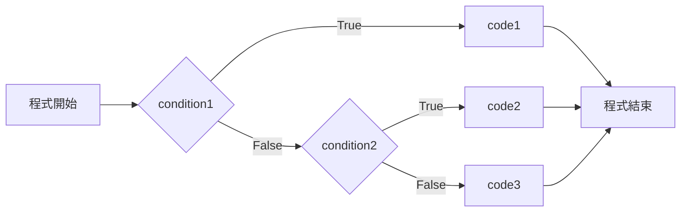
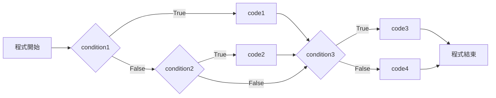

# **Pyhton 筆記**  
## 條件 Condition  

# 基本架構  

```python
if condition1:
    #code1
elif condition2:
    #code2
else:
    #code3
```
判斷條件 `condition1` 是否正確  
若正確，便執行 `code1`  
否則判斷條件 `condition2` 是否正確  
若正確，便執行 `code2`  
否則便執行 `code3`  



## 其他範例  

```python
if condition1:
    #code1
elif condition2:
    #code2
if condition3:
    #code3
else:
    #code4
```


