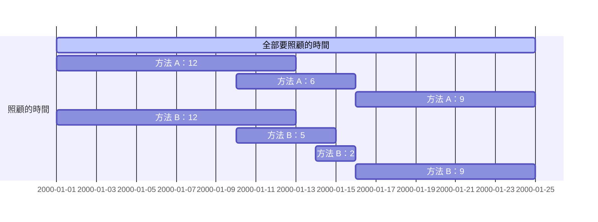

### [22 / babysitter](https://toj.tfcis.org/oj/pro/22/)  

<details>

<summary>題目</summary>

### 題目敘述  
有多個保母應徵工作，每個保母有自己可以工作的時間  
每個保母可以從時間 $X$ 工作到時間 $Y$  
問最少要請幾個保母才可以任何時間寶寶都有人照顧  
    
### 輸入說明  
每筆測資的第一行有一個整數 $N$ ，代表保母個數  
接下來 $N$ 行，每一行有兩個數字 $X,Y$ ，代表這位保母可以從 $X$ 工作到 $Y$  
    
### 輸出說明  
如果任何時間可以都有保母照顧，輸出最少需要幾位保母  
如果不行，輸出 `NO`  
    
### 輸入限制  
$1 \leq N \leq 1000$  
$1 \leq X,Y \leq 100000$  
    
### 範例輸入1
```
6
1 50
2 90
45 150
50 140
151 200
145 190
```

### 範例輸出1
```
3
```

### 範例輸入2
```
3
1 50
60 70
70 100
```

### 範例輸出1
```
NO
```

</details>

<details>

<summary>題解</summary>

一題非常經典的 greedy  

思路：  
時間 $i$ 一定有人需要來顧，所以我們先找顧的到 $i$ 的最好的那個  
接下來呢？  

找做最晚的呢？似乎就可以了... 嗎？  

定義 $A$ 是我們剛剛方法做出來的方案， $B$ 是任何其他的方案  



在第一個 $A$ 跟 $B$ 不一樣的地方來看，我們一定會發現 $A$ 比 $B$ 不來的差  

</details>

<details>

<summary>AC code</summary>

```cpp
#include <bits/stdc++.h>
using namespace std;

bool cmp(pair<int,int> a,pair<int,int> b){
    if(a.first==b.first){
        return a.second>b.second;
    }
    else{
        return a.first<b.first;
    }
}

bool cmp2(pair<int,int> a,pair<int,int> b){
    if(a.second==b.second){
        return a.first<b.first;
    }
    return a.second>b.second;
}

int main(){
    int start=100000,finish=1;
    int n;
    while(cin>>n){
        pair<int,int> p[n+1];
        int a,b;
        for(int i=0;i<n;i++){
            cin>>a>>b;
            p[i].first=min(a,b);
            p[i].second=max(a,b);
            start=min(start,p[i].first);
            finish=max(finish,p[i].second);
        }
        sort(p,p+n,cmp);
        int mx=p[0].second;
        int ans=1;
        int cnt;
        while(mx<finish){
            cnt=0;
            while(p[cnt].first<=mx+1){
                cnt++;
            }
            sort(p,p+cnt,cmp2);
            if(mx==p[0].second){
                cout<<"NO"<<endl;
                return 0;
            }
            mx=p[0].second;
            ans++;
        }
        cout<<ans<<endl;
    }
}
```

</details>
